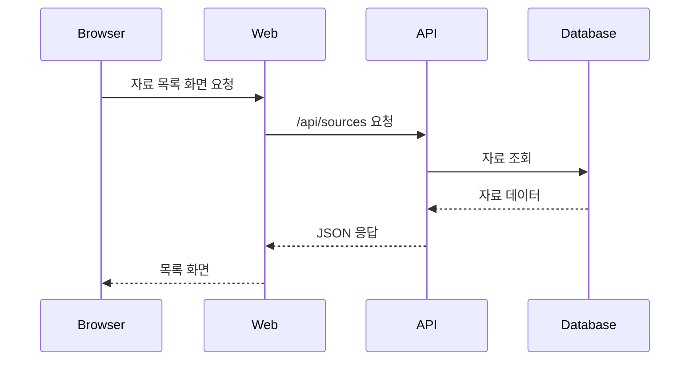
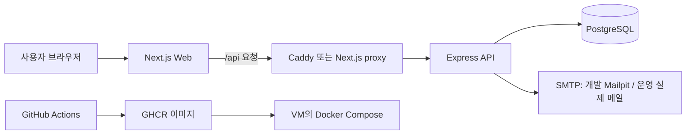

# 01. 서비스와 전체 요청

## 이 교재를 다 읽으면 답할 수 있게 되는 것

이 열 가지에 자기 말로 답할 수 있으면 전체 흐름을 이해한 것이다. 지금은 몰라도 된다. 읽어 나가면서 답이 채워지는지 확인하면 된다.

1. 사용자가 버튼을 누르면 요청이 어떤 순서로 어디까지 가는가?
2. 브라우저는 왜 데이터베이스에 직접 연결하지 않는가?
3. 로그인 상태는 어디에 저장되고 새로고침 뒤 어떻게 복구되는가?
4. 토큰이 만료되면 화면은 어떻게 되는가?
5. 서버 데이터와 화면 상태를 왜 다른 도구로 관리하는가?
6. 자료를 저장하면 목록은 어떻게 저절로 갱신되는가?
7. 남의 글을 수정하려 하면 정확히 어디에서 막히는가?
8. 테이블 관계를 어떤 기준으로 설계했는가?
9. 목록을 나눠 가져오는 방식과 그 한계는 무엇인가?
10. 내 컴퓨터의 코드가 어떻게 인터넷 서비스가 되는가?

## 먼저 생각해 보기

브라우저 화면 하나를 만들기 위해 왜 Next.js, Express, PostgreSQL처럼 여러 프로그램이 필요할까?

## 핵심 해설

SourceWiki는 자료를 저장하고, 인증된 사용자가 댓글·태그·파일을 관리하는 서비스다. 화면을 보여 주는 일과 규칙을 검증하는 일, 데이터를 오래 보관하는 일은 서로 성격이 달라 분리한다.

| 구성 | 하는 일 | 비유 |
| --- | --- | --- |
| Web | 버튼, 입력창, 화면 상태 | 가게의 안내 창구 |
| API | 로그인 확인, 권한 검사, 규칙 적용 | 업무 담당자 |
| DB | 사용자와 자료를 영구 보관 | 장부 보관소 |
| SMTP | 인증 링크가 든 메일 전달 | 우편 서비스 |

API 응답의 JSON은 화면이 이해할 수 있는 약속이다. 화면은 DB에 직접 접근하지 않는다. DB 비밀번호와 권한 규칙을 브라우저에 보내지 않기 위해서다.

## 전체 지도

이 교재가 다루는 범위 전체다. 각 상자가 어느 장에서 설명되는지 함께 표시했다.

| 구간 | 설명하는 장 |
| --- | --- |
| 브라우저 → Web 화면 | [02](./02-monorepo-and-frontend.md), [03](./03-frontend-state-and-data-flow.md), [03b](./03b-server-rendering-and-hydration.md) |
| Web → API 요청·에러 | [04](./04-frontend-api-error-auth.md), [11](./11-api-contract-atlas.md) |
| API 내부 처리 | [05](./05-backend-and-api.md) |
| API → DB | [06](./06-database-and-prisma.md), [12](./12-database-schema-atlas.md) |
| 로그인·메일 | [07](./07-authentication-and-email.md), [08](./08-auth-complete-trace.md) |
| 자료·댓글·페이징 | [09](./09-source-features-and-permissions.md), [09b](./09b-source-crud-complete-trace.md), [09c](./09c-pagination-search-and-files.md) |
| 실행 환경·배포 | [13](./13-docker-and-local-environment.md)~[17](./17-cloud-deployment-and-operations.md) |

## 코드로 확인하기

- `apps/api/src/app.ts` — 들어온 요청의 URL을 보고 어느 기능 담당자에게 넘길지 정하는 곳. 이 파일 하나만 봐도 API가 제공하는 기능 목록을 알 수 있다.
- `apps/web/src/app/layout.tsx` — 모든 화면을 감싸는 껍데기. 헤더와 데이터 캐시가 여기서 한 번 준비된다.
- `apps/api/prisma/schema.prisma` — 데이터가 실제로 어떤 모양으로 보관되는지 적힌 설계도.

## 이해 점검

**Q. 사용자가 자료를 저장할 때 Web이 DB에 바로 쓰지 않는 이유는?**
**A.** 브라우저는 사용자가 조작할 수 있는 환경이다. API가 입력 검증과 로그인·작성자 권한을 확인한 뒤 DB에 쓰는 것이 안전하다.

## 흔한 오해

"프론트엔드가 화면만 담당한다"는 말은 불완전하다. 이 프로젝트의 Web은 폼 검증, API 호출, 로그인 상태 복구, 화면 전환도 담당한다.

---

다음 장 → [02. 모노레포와 프론트엔드](./02-monorepo-and-frontend.md)
