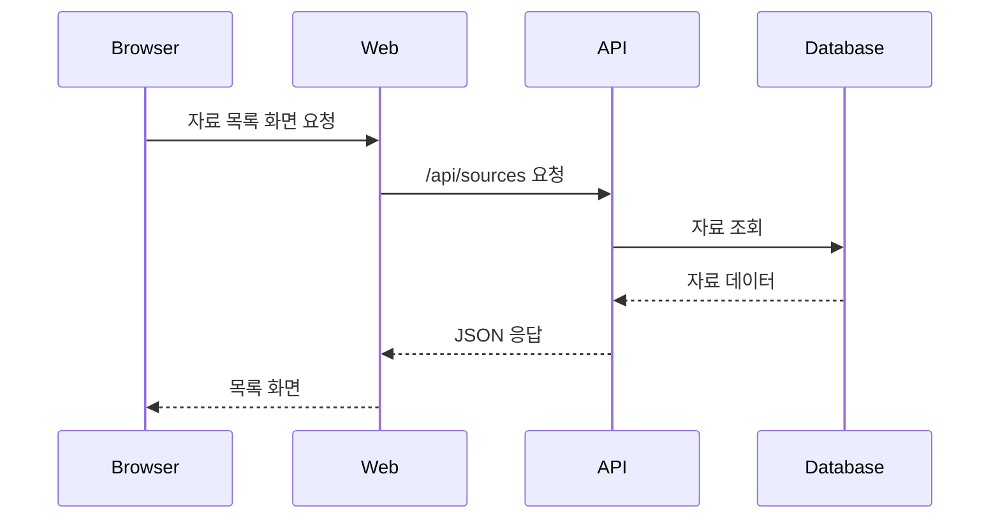

# 01. 서비스와 전체 요청

## 먼저 생각해 보기

브라우저 화면 하나를 만들기 위해 왜 Next.js, Express, PostgreSQL처럼 여러 프로그램이 필요할까?

## 핵심 해설

SourceWiki는 자료를 저장하고, 인증된 사용자가 댓글·태그·파일을 관리하는 서비스다. 화면을 보여 주는 일과 규칙을 검증하는 일, 데이터를 오래 보관하는 일은 서로 성격이 달라 분리한다.

| 구성 | 하는 일 | 비유 |
| --- | --- | --- |
| Web | 버튼, 입력창, 화면 상태 | 가게의 안내 창구 |
| API | 로그인 확인, 권한 검사, 규칙 적용 | 업무 담당자 |
| DB | 사용자와 자료를 영구 보관 | 장부 보관소 |
| SMTP | 인증 링크가 든 메일 전달 | 우편 서비스 |

API 응답의 JSON은 화면이 이해할 수 있는 약속이다. 화면은 DB에 직접 접근하지 않는다. DB 비밀번호와 권한 규칙을 브라우저에 보내지 않기 위해서다.

## 이해 점검

**Q. 사용자가 자료를 저장할 때 Web이 DB에 바로 쓰지 않는 이유는?**  
**A.** 브라우저는 사용자가 조작할 수 있는 환경이다. API가 입력 검증과 로그인·작성자 권한을 확인한 뒤 DB에 쓰는 것이 안전하다.

## 흔한 오해

“프론트엔드가 화면만 담당한다”는 말은 불완전하다. 이 프로젝트의 Web은 폼 검증, API 호출, 로그인 상태 복구, 화면 전환도 담당한다.
