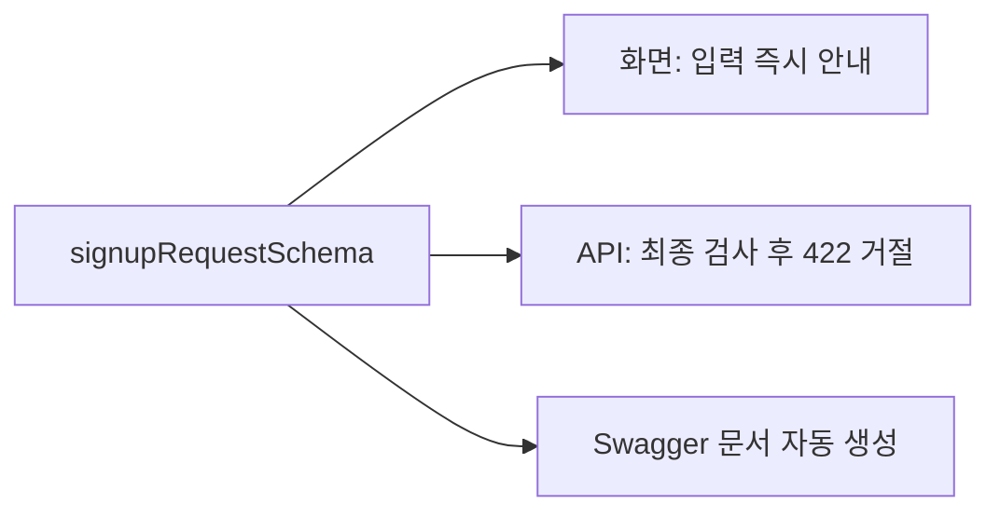

# 02. 모노레포와 프론트엔드

## 이 장에서 답할 수 있게 되는 것

- 저장소가 왜 여러 폴더로 나뉘어 있는가
- 같은 검증 규칙을 Web과 API가 어떻게 함께 쓰는가

## 먼저 생각해 보기

Web과 API가 서로 다른 앱이라면, 이메일 형식 같은 규칙은 어디에 한 번만 적어야 할까?

## 핵심 해설

이 저장소는 `pnpm workspace` 기반 모노레포다. 하나의 Git 저장소 안에 독립 실행 앱과 공용 패키지를 둔다.

```text
apps/web       Next.js + React: 사용자가 보는 화면
apps/api       Express + Prisma: HTTP API와 업무 규칙
packages/shared Zod schema + TypeScript type: 두 앱의 공용 약속
```

`packages/shared`의 Zod schema는 “올바른 이메일, 비밀번호 길이, 요청 형태”를 한 번 정의하고 Web과 API가 함께 쓰게 한다. Web의 검증은 빠른 안내이고, API의 검증은 신뢰 경계에서의 최종 확인이다.

## Zod와 schema가 무엇인가

**schema(스키마)는 "서류 양식"이고, Zod는 그 양식을 만들고 검사까지 해 주는 도구다.**

놀이공원에 "키 120cm 이상만 탑승"이라는 규칙이 있다고 하자.

| 비유 | 실제 |
| --- | --- |
| 키 120cm 이상이라는 규칙 | schema — 지켜야 할 기준 |
| 키 재는 막대 | Zod — 기준을 만들고 실제로 재는 도구 |
| "키가 5cm 모자랍니다" | Zod가 돌려주는 오류 메시지 |

마지막 칸이 중요하다. Zod는 "안 된다"만 말하지 않고 **왜 안 되는지**를 함께 알려 준다. 그 문장이 그대로 화면의 입력칸 아래에 표시된다.

### 실제 코드 읽는 법

`packages/shared/src/index.ts`의 비밀번호 규칙이다.

```ts
export const passwordSchema = z
  .string()                                     // 글자여야 하고
  .min(8,  '비밀번호는 8자 이상이어야 합니다.')    // 8자 이상이어야 하고
  .max(72, '비밀번호는 72자 이하여야 합니다.');   // 72자 이하여야 한다
```

`z`가 Zod이고, 점을 찍으며 **조건을 하나씩 붙여 나간다.** 각 조건 옆의 한국어 문장이 그 조건을 어겼을 때 보여 줄 메시지다.

이렇게 만든 칸들을 모으면 **양식 한 장**이 된다.

```ts
export const signupRequestSchema = z.object({
  email:    emailSchema,      // 이메일 칸
  nickname: nicknameSchema,   // 닉네임 칸
  password: passwordSchema,   // 비밀번호 칸
});
```

회원가입 신청서다. 칸이 세 개인 양식이라고 보면 된다.

### 양식 한 장이 세 군데에서 쓰인다



| 쓰이는 곳 | 하는 일 |
| --- | --- |
| `apps/web/src/features/auth/signup-form.tsx` | 타이핑할 때 바로 "8자 이상이어야 합니다"를 보여 준다 |
| `apps/api/src/middleware/validate.ts` | 들어온 요청을 다시 검사하고, 통과 못 하면 422로 거절한다 |
| `apps/api/src/openapi/document.ts` | "회원가입은 이런 값을 보내야 한다"를 API 문서에 자동으로 넣는다 |

**규칙을 한 곳만 고치면 세 군데가 함께 바뀐다.** 비밀번호를 8자에서 10자로 늘리고 싶으면 `.min(8, ...)`을 한 번 고치면 된다. 이것이 `packages/shared`라는 폴더가 존재하는 이유다.

## 프론트엔드가 쓰는 도구들

| Web 기술 | 이 프로젝트에서의 쓰임 |
| --- | --- |
| Next.js | 페이지와 서버 측 처리, 개발 중 API rewrite |
| React | 입력값과 화면 상태 표현 |
| React Hook Form | 가입·로그인·자료 작성 폼 관리 |
| React Query | 현재 사용자 같은 서버 데이터를 캐시·갱신 |

개발 중에는 Next.js가 `/api/*`를 `localhost:4000` API로 전달한다. 운영에서는 Caddy가 같은 역할을 한다. 그래서 브라우저는 한 도메인만 상대한다.

## 이해 점검

**Q. Web에서 이미 이메일을 검사하는데 API도 검사하는 이유는?**  
**A.** 브라우저 검사는 사용자가 우회할 수 있다. API 검사가 실제 데이터 저장의 기준이다.

## 흔한 오해

모노레포는 앱을 하나로 합치는 방식이 아니다. 실행 책임은 Web과 API에 남기고, 변경을 함께 관리하는 방식이다.

## 코드 따라가기

- `apps/web/src/app/layout.tsx`: 모든 화면을 `QueryProvider`로 감싼다. 즉, 페이지마다 따로 상태 저장소를 만들지 않고 하나의 QueryClient를 공유한다.
- `apps/web/src/features/auth/login-form.tsx`: React Hook Form과 shared Zod schema로 입력을 확인하고, 로그인 성공 시 `['auth', 'me']` 캐시를 즉시 갱신한다.
- `apps/web/src/features/sources/source-form.tsx`: 자료 생성·수정 뒤 목록/파일 query를 무효화해 오래된 화면을 다시 가져오게 한다.

---

다음 장 → [03. Frontend 상태관리와 데이터 흐름](./03-frontend-state-and-data-flow.md)
