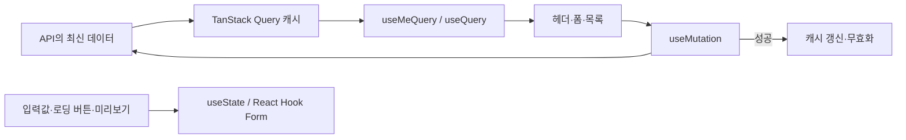

# 03. Frontend 상태관리와 데이터 흐름

## 먼저 생각해 보기

로그인 사용자 정보와 “현재 열려 있는 입력창의 닉네임”은 둘 다 상태다. 그런데 왜 같은 도구에 넣지 않을까?

## 핵심 결론

이 프로젝트는 Redux나 Zustand 같은 별도 전역 Store를 사용하지 않는다. **서버에서 온 데이터는 TanStack Query**, **화면 안에서만 잠깐 필요한 값은 React `useState` 또는 React Hook Form**으로 나눈다.

## 어떤 데이터를 어디에 두는가?

| 데이터 | 위치 | 이유 |
| --- | --- | --- |
| 현재 로그인 사용자 | Query key `['auth', 'me']` | 서버의 `/api/auth/me`가 진실의 원천 |
| 자료 목록/상세/파일 | feature별 Query key | 여러 화면이 재사용하고 최신화가 필요 |
| 폼 입력값·필드 오류 | React Hook Form | 현재 화면에서만 의미 있고 검증과 연결됨 |
| 로그아웃 진행 중 여부 | `useState` | 버튼 UI만 위한 짧은 상태 |
| URL 추출 미리보기·선택 파일 | `useState` | 저장 전 임시 데이터 |

`QueryProvider`는 `apps/web/src/lib/query/query-provider.tsx`에서 루트 layout에 한 번 등록된다. 기본 query는 한 번 재시도하고, 창에 다시 포커스되어도 자동 재요청하지 않는다. mutation은 자동 재시도하지 않는다. 사용자가 의도하지 않은 자료 생성·수정을 반복하지 않기 위해서다.

## 로그인 상태가 화면에 전달되는 과정

`useMeQuery`는 `/api/auth/me`를 조회하고 성공한 사용자 데이터를 캐시한다. 401은 예외 화면이 아니라 “현재 로그인하지 않음”으로 해석해 `null`을 반환한다. 헤더의 `AuthActions`, 프로필 폼, 자료 작성 폼이 같은 query key를 읽으므로 서로 같은 로그인 상태를 본다.

로그인 성공 시 `login-form.tsx`는 응답의 사용자 데이터를 `['auth', 'me']`에 바로 저장한다. 로그아웃은 서버에 요청한 다음 그 캐시를 `null`로 바꾼다. 따라서 전체 페이지를 새로 고치지 않아도 헤더가 즉시 변한다.

## 자료 변경 후 왜 invalidate하는가?

자료 생성/수정 성공 뒤 `source-form.tsx`는 자료 목록과 파일 query를 무효화한다. 이전 목록을 그대로 보여 주면 방금 만든 자료가 없거나 오래된 제목이 보일 수 있기 때문이다. TanStack Query는 “서버 데이터가 바뀌었다”는 사실을 캐시에 알리고 필요한 화면에서 다시 가져오게 한다.

## 발표 답변 카드

### 상태 관리는 어떤 라이브러리를 사용했나요?

**30초 답변:** “전역 Store 라이브러리 대신 TanStack Query를 서버 상태 관리에 사용했습니다. 로그인 사용자, 자료 목록·상세처럼 API가 진실의 원천인 데이터는 Query cache에 두고, 폼 입력값이나 버튼 로딩 상태처럼 화면에만 필요한 값은 React Hook Form과 `useState`로 분리했습니다.”

**코드 근거:** `QueryProvider`, `useMeQuery`, `source-form.tsx`의 `useQuery`/`useMutation`.

### 왜 Redux/Zustand가 아니라 TanStack Query인가요?

**답변:** “이 프로젝트의 공유 상태 대부분은 서버 데이터입니다. TanStack Query는 fetch, caching, loading/error 상태, mutation 뒤 재검증을 한 흐름으로 제공하므로 별도 전역 Store에 API 결과를 중복 보관할 필요가 없었습니다. 복잡한 전역 UI 상태가 추가되면 그때 Zustand 같은 도구를 검토할 수 있습니다.”

### 꼬리 질문: 로그인 토큰도 Query에 저장하나요?

**답변:** “아닙니다. 토큰 원문은 JavaScript 메모리나 Query cache에 저장하지 않습니다. 서버가 `httpOnly` 쿠키로 관리하고, Query에는 `/me` 응답의 사용자 정보만 저장합니다.”

## 이해 점검

**Q. `['auth', 'me']`를 로그아웃 때 null로 바꾸는 이유는?**  
**A.** 서버 쿠키 삭제가 성공한 직후 화면도 즉시 비로그인 상태로 맞추기 위해서다. 다음 `/me` 조회도 서버의 쿠키 상태를 다시 확인한다.

## 현재 구현의 한계와 개선 방향

목록 query는 feature별로 관리되며, 전역 UI 상태가 복잡하지 않아 별도 client store는 없다. 알림 큐, 다중 탭 편집 상태, 오프라인 동기화가 커지면 UI store 도입 기준을 다시 세워야 한다.
