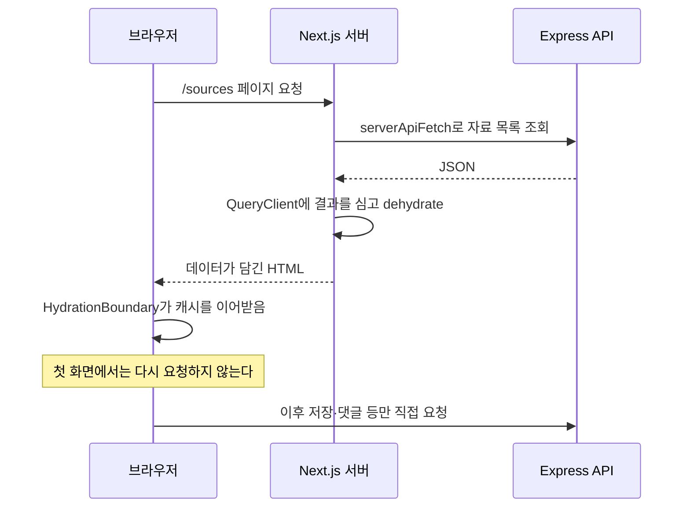

# 03b. 서버 렌더링과 화면 이어받기(hydration)

## 이 장에서 답할 수 있게 되는 것

- "이 프로젝트는 SSR인가요, CSR인가요?"
- 목록 화면을 열었을 때 **브라우저가 왜 같은 데이터를 다시 요청하지 않는가?**
- `apiFetch`와 `serverApiFetch`는 왜 두 개인가?

## 먼저 생각해 보기

자료 목록 화면을 열면 데이터를 누가 가져올까? 브라우저가 화면을 그린 뒤 요청할 수도 있고, 서버가 미리 가져와 완성된 화면을 보낼 수도 있다. 두 방식은 무엇이 다를까?

## 핵심 해설

식당에 비유하면 이렇다. **서버가 밥상을 미리 차려서 내보내고(서버 렌더링), 브라우저는 그 밥상을 그대로 이어받아 계속 쓴다(hydration).** 손님이 자리에 앉자마자 주문부터 하는 것이 아니라, 이미 차려진 상을 받고 그다음부터 추가 주문을 하는 셈이다.

SourceWiki는 **둘 다 쓴다.**

| 구분 | 누가 가져오는가 | 이 프로젝트의 예 |
| --- | --- | --- |
| 첫 화면 | Next.js 서버 | `/`, `/sources`, `/sources/[id]`, `/users/[id]` |
| 이후 상호작용 | 브라우저 | 자료 저장, 댓글 작성, 좋아요, 목록 갱신 |

## 두 개의 fetch 함수

| | `apiFetch` | `serverApiFetch` |
| --- | --- | --- |
| 파일 | `apps/web/src/lib/api/api-client.ts` | `apps/web/src/lib/api/server-api.ts` |
| 실행 위치 | 브라우저 | Next.js 서버 |
| 주소 | `/api/*` 상대 경로 | `API_INTERNAL_URL`로 API에 직접 |
| 쿠키 | 브라우저가 자동으로 붙임(`credentials: 'include'`) | `next/headers`의 `cookies()`를 읽어 직접 헤더에 넣음 |
| 부가 기능 | timeout, 401 refresh 재시도, `ApiError` 변환 | 없음(단순 조회) |

서버에는 브라우저가 없으므로 쿠키가 자동으로 붙지 않는다. 그래서 `serverApiFetch`는 요청에 담겨 온 쿠키를 읽어 API에 그대로 전달한다. 이 덕분에 **서버에서 조회해도 "지금 로그인한 사람" 기준의 응답**을 받는다.

`server-api.ts` 첫 줄의 `import 'server-only'`는 이 파일이 실수로 브라우저 번들에 들어가는 것을 막는 안전장치다.

## 서버가 가져온 데이터를 클라이언트가 이어받는 방법

`apps/web/src/app/sources/page.tsx`가 이 과정을 그대로 보여 준다.

1. 서버에서 자료 목록과 `/api/auth/me`를 **동시에** 조회한다.
2. 새 `QueryClient`를 만들고 `setQueryData`로 결과를 심는다. 이때 쓰는 key는 클라이언트가 쓸 key와 **똑같아야 한다**(`sourceKeys.list(listQuery)`, `['auth', 'me']`).
3. `dehydrate(queryClient)`로 캐시를 직렬화해 `<HydrationBoundary state={...}>`에 넘긴다.
4. 안에 있는 `SourceList`가 `useQuery`를 호출하면 **이미 캐시에 값이 있으므로 네트워크 요청이 발생하지 않는다.**

key가 서로 다르면 이 연결이 끊어지고 화면이 로딩부터 다시 시작한다. **서버와 클라이언트가 같은 key를 쓰는 것이 hydration의 핵심**이다.

> 네 화면(`/`, `/sources`, `/sources/[id]`, `/users/[id]`)이 모두 서버에서 데이터를 가져오지만, 캐시를 이어 주는 `HydrationBoundary`는 **자료 목록과 자료 상세** 두 화면에서 쓴다. 나머지 두 화면은 받은 데이터를 그대로 그리기만 해서 클라이언트 캐시가 필요 없다.

## 라우트 보호는 서버가 하지 않는다

이 프로젝트에는 `middleware.ts`가 **없다.** `/sources/new`, `/profile` 같은 화면은 서버에서 로그인 여부를 검사하지 않고, 클라이언트 컴포넌트가 `useEffect`로 로그인 페이지에 보낸다.

- `apps/web/src/features/sources/source-form.tsx` → `/login?returnTo=/sources/new`
- `apps/web/src/features/users/profile-form.tsx` → `/login?returnTo=/profile`

이것은 **사용자 경험**이지 보안이 아니다. 실제 차단은 API가 한다. 자세한 권한 구조는 [09b. 자료·댓글 CRUD 완전 추적](./09b-source-crud-complete-trace.md)에서 다룬다.

## 이해 점검

**Q. 목록 화면을 새로고침하면 요청이 몇 번 나갈까?**
**A.** 브라우저 관점에서는 페이지 요청 한 번이다. 목록 데이터는 Next.js 서버가 API에서 받아 HTML에 담아 보내므로, 브라우저가 `/api/sources`를 따로 부르지 않는다.

**Q. 서버에서 이미 가져왔는데 TanStack Query를 왜 또 쓰는가?**
**A.** 첫 화면 이후가 필요하기 때문이다. 자료를 저장하거나 댓글을 달면 목록이 바뀌어야 하는데, 그 갱신은 클라이언트 캐시가 담당한다.

## 흔한 오해

"Next.js를 썼으니 전부 서버에서 렌더링된다"는 말은 정확하지 않다. `'use client'`가 붙은 컴포넌트는 브라우저에서 동작하고, 이 프로젝트의 폼·댓글·파일 패널이 모두 그렇다. **첫 데이터는 서버, 이후 변경은 클라이언트**로 나뉜다고 말해야 정확하다.

---

다음 장 → [04. Frontend API·에러·인증 심화](./04-frontend-api-error-auth.md)
