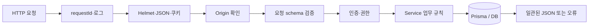

# 05. 백엔드와 API

## 먼저 생각해 보기

누군가 주소창이나 개발자 도구로 API를 직접 호출하면, 화면의 제한만으로 막을 수 있을까?

## 핵심 해설

`apps/api`는 Express 5 서버다. 모든 요청은 공통 middleware를 지나 적절한 router와 service로 간다.

`app.ts`는 `/api/auth`, `/api/sources`, `/api/comments`, `/api/files`, `/api/users`, `/api/tools`를 연결한다. router는 HTTP 형식과 middleware를 조합하고, service는 “누가 무엇을 할 수 있는가” 같은 업무 규칙을 처리한다.

오류도 API의 약속이다. 예를 들어 인증이 필요하면 `401`, 권한이 없으면 `403`, 메일 전달 실패면 `503`을 반환한다. 오류 응답에는 `requestId`가 있어 서버 로그와 문제를 연결할 수 있다.

## 이해 점검

**Q. router와 service를 나누는 장점은?**  
**A.** HTTP 경로·응답 변경과 업무 규칙 변경을 분리할 수 있고, service를 통합 테스트로 검증하기 쉬워진다.

## 흔한 오해

API는 DB를 단순 조회하는 통로가 아니다. 입력 검증, 보안, 권한, 외부 SMTP 호출을 조정하는 신뢰 가능한 중간 계층이다.

## 코드 따라가기

- `apps/api/src/app.ts`는 보안 middleware와 모든 `/api/*` router를 등록하는 진입점이다.
- `apps/api/src/middleware/error-handler.ts`는 예상된 `AppError`를 상태 코드·오류 코드·필드 오류·`requestId`가 있는 JSON으로 바꾼다. 예상하지 못한 오류는 로그에 남기고 `500 INTERNAL_ERROR`로 숨긴다.
- `apps/api/src/middleware/authenticate.ts`와 `authorize.ts`는 쿠키 속 access token, 이메일 인증 여부를 확인한다. Web의 버튼/리다이렉트는 편의 기능이고 최종 보안은 이 계층이 담당한다.
