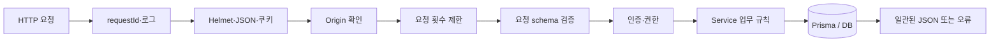

# 05. 백엔드와 API

## 이 장에서 답할 수 있게 되는 것

- 요청 하나가 API 안에서 거치는 순서
- Route와 Service를 왜 나누는가
- 쿠키로 로그인하는데 **CORS 설정이 없는 이유**

## 먼저 생각해 보기

누군가 주소창이나 개발자 도구로 API를 직접 호출하면, 화면의 제한만으로 막을 수 있을까?

## 핵심 해설

`apps/api`는 Express 5 서버다. 모든 요청은 공통 middleware를 지나 적절한 router와 service로 간다.

`app.ts`는 `/api/auth`, `/api/sources`, `/api/comments`, `/api/files`, `/api/users`, `/api/tools`를 연결한다. router는 HTTP 형식과 middleware를 조합하고, service는 "누가 무엇을 할 수 있는가" 같은 업무 규칙을 처리한다.

## 응답의 모양은 항상 같다

| 종류 | 모양 |
| --- | --- |
| 성공 | `{ data, meta: { requestId } }` |
| 목록 | `{ data, pagination, meta: { requestId } }` |
| 생성 | 위와 같고 상태 코드만 `201` |
| 삭제 | 본문 없이 `204` |
| 오류 | `{ error: { code, message, requestId, fieldErrors? } }` |

모양을 고정해 두면 프론트엔드의 공통 래퍼가 **모든 응답을 같은 방식으로 처리**할 수 있다. 화면마다 응답 구조를 다르게 해석할 필요가 없다.

`requestId`는 요청이 들어올 때 만들어져 로그와 오류 응답에 함께 실린다. 사용자가 "오류가 났어요"라며 이 값을 알려 주면 서버 로그에서 그 요청만 정확히 찾을 수 있다.

## Origin 검사 — CORS 설정이 없는 이유

이 프로젝트에는 `cors` 패키지가 **없다.** 브라우저에서 보면 Web과 API가 같은 주소(`/api/*`)이기 때문이다. 개발에서는 Next.js가, 운영에서는 Caddy가 같은 도메인 안에서 API로 넘겨준다([14장](./14-caddy-and-network.md)). 출처가 다르지 않으니 CORS 협상 자체가 필요 없다.

대신 다른 문제가 생긴다. **쿠키는 브라우저가 자동으로 붙인다.** 사용자가 악성 사이트를 열었을 때 그 사이트가 우리 API로 요청을 보내면 쿠키도 함께 실려 간다. 이것이 CSRF다.

`apps/api/src/middleware/origin.ts`의 `verifyOrigin`이 이를 막는다.

| 요청 | 처리 |
| --- | --- |
| `GET`, `HEAD`, `OPTIONS` | 통과 — 읽기는 데이터를 바꾸지 않는다 |
| 그 외(POST/PATCH/DELETE) | `Origin` 헤더가 `APP_URL`과 **정확히 같아야** 통과. 아니면 403 `ORIGIN_NOT_ALLOWED` |

`Origin` 헤더는 브라우저가 붙이고 **자바스크립트가 위조할 수 없다.** 그래서 "우리 화면에서 온 변경 요청"만 통과시킬 수 있다. 쿠키의 `sameSite` 설정과 함께 두 겹으로 막는 셈이다.

## 요청 횟수 제한(rate limit)

비밀번호를 자동으로 계속 시도하거나, 가입 메일을 대량 발송시키는 공격을 막는다. `apps/api/src/middleware/rate-limit.ts`가 만들고 **경로마다 다르게** 건다.

| 경로 | 제한 |
| --- | --- |
| 회원가입 | 1시간에 5회 |
| 인증 메일 재전송 | 1시간에 3회 |
| 로그인·이메일 확인 | 15분에 10회 |
| 토큰 갱신·로그아웃 | 15분에 30회 |
| AI 요약·채팅 | 15분에 10~30회 |

메일을 보내거나 돈이 드는 작업일수록 촘촘하게, 자주 일어나는 정상 동작일수록 넉넉하게 잡는다.

## 오류는 어떻게 한곳으로 모이는가

Express 5부터는 **async 함수에서 던진 오류를 프레임워크가 자동으로 오류 처리기로 넘긴다.** 그래서 이 프로젝트의 라우트에는 `try/catch`가 없다. 서비스에서 `throw new AppError(403, 'FORBIDDEN', ...)`만 하면 `error-handler.ts`가 받아 정해진 JSON 모양으로 바꾼다.

예상하지 못한 오류는 로그에만 자세히 남기고 사용자에게는 `500 INTERNAL_ERROR`로만 알린다. 내부 구조나 DB 오류 문구가 밖으로 새지 않게 하기 위해서다.

## 이해 점검

**Q. router와 service를 나누는 장점은?**
**A.** HTTP 경로·응답 변경과 업무 규칙 변경을 분리할 수 있고, service를 통합 테스트로 검증하기 쉬워진다.

**Q. CORS 설정을 안 했는데 안전한가?**
**A.** CORS는 다른 출처의 요청을 다루는 규칙이다. 이 서비스는 같은 출처로 묶여 있어 해당하지 않고, 쿠키 인증의 위험은 `Origin` 검증과 `sameSite` 쿠키로 막는다.

## 흔한 오해

API는 DB를 단순 조회하는 통로가 아니다. 입력 검증, 보안, 권한, 외부 SMTP 호출을 조정하는 신뢰 가능한 중간 계층이다.

## 코드 따라가기

- `apps/api/src/app.ts` — 보안 middleware와 모든 `/api/*` router를 등록하는 진입점이다.
- `apps/api/src/middleware/error-handler.ts` — 예상된 `AppError`를 상태 코드·오류 코드·필드 오류·`requestId`가 있는 JSON으로 바꾼다.
- `apps/api/src/middleware/authenticate.ts`와 `authorize.ts` — 쿠키 속 access token, 이메일 인증 여부를 확인한다. Web의 버튼/리다이렉트는 편의 기능이고 최종 보안은 이 계층이 담당한다.
- `apps/api/src/middleware/validate.ts` — 요청 본문을 shared Zod schema로 검사하고, 실패하면 422와 `fieldErrors`를 만든다.

---

다음 장 → [06. 데이터베이스와 Prisma](./06-database-and-prisma.md)
