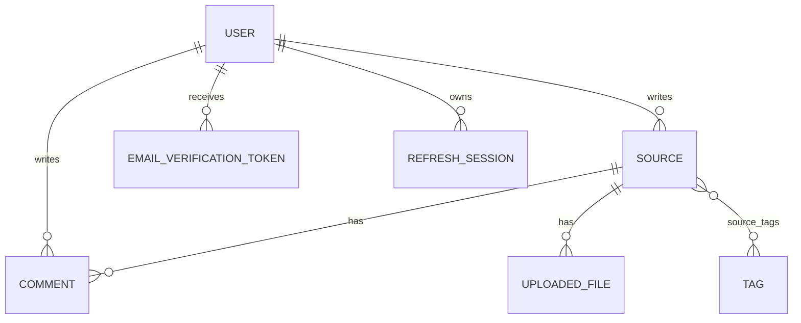

# 06. 데이터베이스와 Prisma

## 이 장에서 답할 수 있게 되는 것

- 데이터가 어떤 모양과 관계로 보관되는가
- migration과 seed는 무엇이 다른가

## 먼저 생각해 보기

서버를 재시작해도 사용자와 자료가 사라지지 않으려면 데이터는 어디에, 어떤 관계로 보관돼야 할까?

## 핵심 해설

PostgreSQL은 영구 데이터베이스이고 Prisma는 TypeScript 코드가 DB를 안전하게 다루도록 돕는 ORM이다. Prisma schema는 애플리케이션의 데이터 설계도이며, migration은 설계도 변경을 실제 DB에 순서대로 적용한 기록이다.

| 테이블 | 보관하는 핵심 |
| --- | --- |
| `users` | 계정, 비밀번호 해시, 인증 완료 시각 |
| `sources` | 자료 URL, 원문, 요약, 작성자 |
| `comments` | 자료별 댓글과 작성자 |
| `tags` / `source_tags` | 태그와 자료의 다대다 관계 |
| `email_verification_tokens` | 해시된 인증 토큰과 만료 시각 |
| `refresh_sessions` | 회전하는 로그인 세션 |

비밀번호와 인증 토큰 원문은 DB에 저장하지 않는다. 유출되더라도 원문을 바로 재현하기 어렵게 해시값을 저장한다.

## 이해 점검

**Q. migration과 seed의 차이는?**  
**A.** migration은 모든 환경에 필요한 테이블 구조 변경이고, seed는 개발·시연용 예시 데이터를 넣는 선택 작업이다. 운영 DB에 seed가 비어 있는 것은 정상이다.

## 흔한 오해

Prisma가 DB를 대체하는 것은 아니다. Prisma는 PostgreSQL과 대화하는 도구이고, 실제 데이터와 제약은 PostgreSQL에 있다.

## 관계를 설계한 기준

관계는 “누가 소유하는가, 한쪽에 몇 개가 붙는가, 부모가 없어졌을 때 자식 데이터를 어떻게 할 것인가”로 정했다.

- 한 사용자는 여러 자료·댓글·세션·인증 토큰을 만든다. 그래서 이 데이터들은 `userId`를 가진 1:N 관계다.
- 자료와 태그는 서로 여러 개를 가질 수 있다. 그래서 `source_tags`라는 N:M 연결 테이블을 둔다.
- 자료를 지우면 그 자료만 의미 있는 댓글·파일·태그 연결·좋아요는 함께 삭제(`Cascade`)한다.
- 사용자를 지울 때 자료 작성자를 자동으로 지우면 기록의 의미가 불명확해질 수 있어 일부 관계는 `Restrict`다.

---

다음 장 → [07. 인증과 이메일](./07-authentication-and-email.md)
