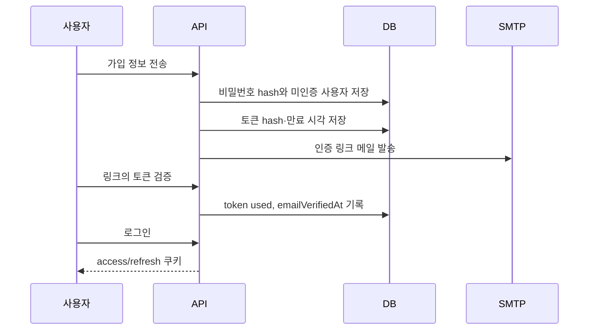

# 07. 인증과 이메일

## 이 장에서 답할 수 있게 되는 것

- 왜 이메일 인증을 마쳐야 로그인이 되는가
- JWT에 무엇을 담았고 무엇을 담지 않았는가

## 먼저 생각해 보기

비밀번호가 맞아도 이메일 인증 전에는 왜 로그인시키지 않을까? 로그인 상태는 왜 DB와 쿠키를 함께 쓸까?

## 핵심 해설

회원가입은 계정을 만들고, 이메일 소유를 확인한 뒤에야 로그인을 허용하는 세 단계다.

운영은 Gmail 같은 실제 SMTP를 사용한다. Mailpit은 개발·CI에서만 메일을 가로채 화면으로 보여 주는 도구다. `SMTP_FROM`/`SMTP_USER`는 발신 계정이고, `SMTP_PASSWORD`는 Gmail 일반 비밀번호가 아니라 앱 비밀번호다.

로그인 뒤 access token은 짧게, refresh token은 길게 유지한다. refresh token을 사용할 때마다 새 토큰으로 교체하고 이전 토큰을 폐기한다. 폐기된 토큰의 재사용은 세션 가족 전체를 끊어 탈취 피해를 줄인다.

## 이해 점검

**Q. 가입 요청이 503인데 users 행이 남을 수 있는 이유는?**  
**A.** 계정과 인증 토큰 저장 뒤 SMTP 발송을 시도하기 때문이다. 메일만 실패한 경우 계정은 미인증으로 남으며 재전송할 수 있다.

## 흔한 오해

`/api/auth/refresh`의 401은 쿠키가 없는 비로그인 방문에서 흔할 수 있다. 항상 가입 기능의 실패 원인은 아니다.

## JWT에는 무엇이 들어가는가?

`apps/api/src/lib/jwt.ts` 기준으로 JWT에는 다음처럼 **인증에 필요한 최소 정보**만 넣는다.

| claim | 뜻 | 넣는 이유 |
| --- | --- | --- |
| `sub` | 사용자 ID | API가 누구의 요청인지 식별 |
| `type` | `access` 또는 `refresh` | 다른 용도의 토큰을 잘못 쓰지 않게 구분 |
| `jti` | 토큰/세션 ID | refresh token 회전과 재사용 탐지 |
| `iss`, `aud` | 발급자, 대상 | 다른 서비스에서 온 토큰 혼동 방지 |
| `iat`, `exp` | 발급/만료 시각 | 유효 시간 강제 |

이메일, 닉네임, 비밀번호, 권한 목록처럼 자주 바뀌거나 민감한 정보는 넣지 않는다. 특히 비밀번호 해시는 JWT에도 넣지 않는다. access token은 15분, refresh token은 14일이며 서로 다른 비밀키로 서명한다.

---

다음 장 → [08. 인증 기능 완전 추적](./08-auth-complete-trace.md)
