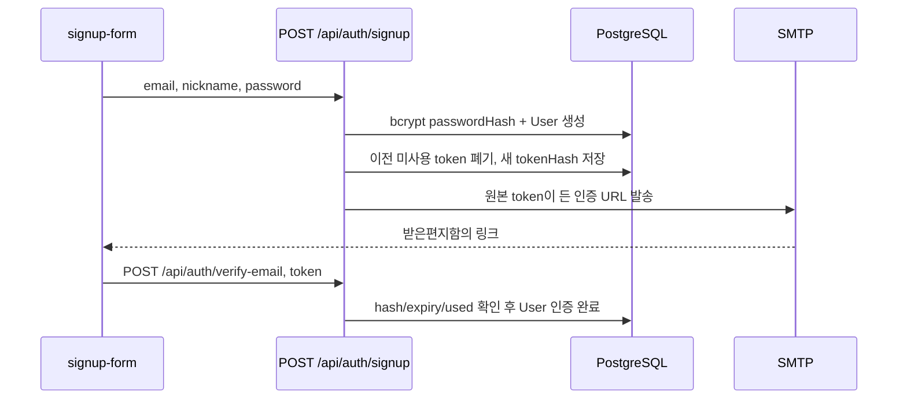

# 08. 인증 기능 완전 추적

## 이 장에서 답할 수 있게 되는 것

- 회원가입부터 로그아웃까지의 코드 경로
- 새로고침해도 로그인이 유지되는 이유
- 토큰 재사용 탐지가 필요한 이유

## 먼저 생각해 보기

회원가입, 이메일 인증, 로그인, 새로고침, 로그아웃은 모두 “인증”이다. 그런데 DB에 같은 토큰 하나만 저장하면 왜 부족할까?

각 단계의 목적이 다르기 때문이다. 이메일 토큰은 이메일 소유 확인용, access JWT는 짧은 API 접근용, refresh JWT와 DB 세션은 긴 로그인 유지와 탈취 탐지용이다.

## 1. 회원가입과 이메일 인증

### 코드 추적

| 단계 | Web | API/DB |
| --- | --- | --- |
| 입력 검증 | `signup-form.tsx` + shared schema | `signupRequestSchema` 재검증 |
| 가입 | `authApi.signup` | `auth.routes.ts` → `auth.service.signup` |
| 토큰 생성 | 없음 | `issueVerification` → `EmailVerificationToken` |
| 메일 | 인증 대기 페이지 | `integrations/mail.ts` Nodemailer |
| 링크 처리 | `verify-email-result.tsx` | `verifyEmail` transaction |

**왜 token 원문 대신 hash를 저장하나?** DB가 유출되어도 이메일 링크의 원문 토큰을 그대로 사용할 수 없게 하기 위해서다. 비밀번호와 같은 원리다.

**왜 가입 후 SMTP 실패가 503인가?** User와 token 저장은 이미 성공했지만 링크를 전달하지 못했기 때문이다. 따라서 재가입이 아니라 재전송이 맞다.

## 2. 로그인과 쿠키

로그인 service는 email로 User를 찾고 bcrypt로 passwordHash를 비교한다. `emailVerifiedAt`이 없으면 `403 EMAIL_NOT_VERIFIED`를 반환한다. 성공하면 access/refresh JWT를 만들고 `auth.routes.ts`가 쿠키로 설정한다.

| 쿠키 | 유효 기간 | path / sameSite | 쓰임 |
| --- | --- | --- | --- |
| `access_token` | 15분 | `/`, `lax` | 일반 API 인증 |
| `refresh_token` | 14일 | `/api/auth`, `strict` | access 재발급 |

둘 다 `httpOnly`이고 운영에서는 `secure=true`다. JavaScript가 토큰을 읽지 못하는 대신, XSS가 토큰을 훔치는 위험을 줄인다.

## 3. 새로고침과 refresh rotation

1. 브라우저 새로고침 뒤 TanStack Query 메모리는 비어도 쿠키는 남아 있다.
2. `useMeQuery`가 `/api/auth/me`를 호출한다.
3. access가 만료돼 401이면 `apiFetch`가 `/api/auth/refresh`를 한 번 호출한다.
4. refresh service는 JWT 서명·type·`jti`, DB `refresh_sessions` hash·만료·폐기를 함께 검사한다.
5. 성공하면 새 access/refresh를 만들고 이전 refresh session에 `revokedAt`, `replacedById`를 기록한다.
6. 원래 요청을 한 번만 재시도한다.

### 재사용 탐지가 필요한 이유

이전에 교체된 refresh token이 다시 들어오면 탈취된 토큰일 수 있다. 이 프로젝트는 같은 `familyId`의 살아 있는 세션을 모두 revoke하고 `SESSION_REUSED`로 다시 로그인하게 한다.

## 4. 실패 분기 발표 연습

| 현상 | 어디까지 성공했나 | 다음으로 볼 곳 |
| --- | --- | --- |
| signup 503 + users 행 존재 | DB User/token 저장 | SMTP host/user/app password |
| login 403 | 비밀번호 비교 | `emailVerifiedAt`과 재전송 |
| `/me` 401 | 쿠키 없음/만료 가능 | refresh 가능 여부 |
| refresh 401 | access 갱신 실패 | refresh cookie, DB 세션, 재사용 |
| token expired | 링크는 정상 | 30분 만료 뒤 재전송 |

## 소크라틱 점검

**Q. access JWT가 만료될 때 User table을 매번 읽지 않는 이유는?**  
**A.** access JWT의 서명과 만료는 빠르게 확인할 수 있다. 단, 이메일 인증 여부 같은 현재 상태는 보호된 쓰기 작업에서 DB로 다시 확인한다.

**Q. 토큰을 localStorage에 두지 않은 대가는?**  
**A.** JavaScript가 직접 Authorization header를 만들 수 없고 CSRF 같은 쿠키 특성도 고려해야 한다. 대신 httpOnly, SameSite, Origin 검증으로 위험을 낮춘다.

---

다음 장 → [09. 자료 기능과 권한](./09-source-features-and-permissions.md)
