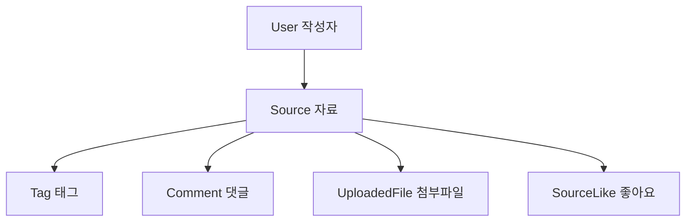

# 09. 자료 기능과 권한

## 이 장에서 답할 수 있게 되는 것

- 이 서비스의 중심 데이터가 무엇이고 무엇이 붙어 있는가
- 기능별로 누가 할 수 있고, 그 판단을 어디에서 하는가

> **용어 매핑**: 과제의 "게시글"이 이 프로젝트의 **`Source`(자료)**, "댓글"이 **`Comment`**다.

## 먼저 생각해 보기

자료를 보는 사람과 수정하는 사람의 권한은 어디에서 구분해야 안전할까?

## 핵심 해설

SourceWiki의 중심 데이터는 `Source`다. 자료에는 URL·제목·원문·개인 메모·태그·파일·댓글·좋아요가 붙는다. URL을 입력하면 tools 기능이 공개 URL 본문을 안전하게 추출하고, 작성자는 결과를 검토해 저장한다.

| 기능 | 누가 할 수 있는가 | 핵심 확인 |
| --- | --- | --- |
| 목록·상세 읽기 | 누구나 | 로그인했으면 개인화 값이 추가됨 |
| 자료 작성 | 로그인 + 이메일 인증 사용자 | access token 쿠키 |
| 자료 수정·삭제 | **작성자 본인** | `source.userId`와 요청자 비교 |
| 댓글 작성 | 로그인 + 이메일 인증 사용자 | 인증 + 입력 길이 |
| 댓글 수정·삭제 | **댓글 작성자 본인** | `comment.userId`와 요청자 비교 |
| 파일 업로드·삭제 | **자료 작성자** | 소유권 + 크기 + 형식 |
| 좋아요 | 로그인 + 이메일 인증 사용자 | 사용자·자료 복합 키로 중복 방지 |

## 권한을 판단하는 위치

권한은 버튼을 숨기는 것으로 끝나지 않는다. 개발자 도구로 API를 직접 부를 수 있으므로, **API가 요청마다 다시 확인**해야 한다.

| 확인 | 위치 |
| --- | --- |
| 로그인했는가 | `apps/api/src/middleware/authenticate.ts` |
| 이메일 인증을 마쳤는가 | `apps/api/src/middleware/authorize.ts`의 `requireVerifiedUser` |
| 이 자료의 작성자인가 | `apps/api/src/modules/sources/source.service.ts`의 `assertOwner` |
| 이 댓글의 작성자인가 | `apps/api/src/modules/comments/comment.service.ts` |
| 이 파일을 다룰 수 있는가 | `apps/api/src/modules/files/file.service.ts` |

읽기 요청에는 `optionalAuthenticate`를 쓴다. **쿠키가 있으면 누구인지 알아내고 없으면 그냥 통과**시켜서, 비로그인 방문자도 자료를 읽되 로그인한 사람에게는 "내가 좋아요를 눌렀는지" 같은 값을 함께 줄 수 있다.

## 이해 점검

**Q. 태그를 별도 테이블과 연결 테이블로 나누는 이유는?**
**A.** 하나의 자료는 여러 태그를 가질 수 있고, 하나의 태그도 여러 자료에 붙을 수 있기 때문이다. 자세한 설계 근거는 [12장](./12-database-schema-atlas.md)에 있다.

**Q. 화면에서 수정 버튼을 숨겼는데 왜 서버도 확인해야 하는가?**
**A.** 버튼을 숨기는 것은 화면의 일이고, 요청은 화면 없이도 보낼 수 있기 때문이다.

## 흔한 오해

AI 요약은 자료 본문을 자동으로 덮어쓰지 않는다. 현재는 사용자가 검토하는 보조 기능이며 운영에서는 `demo` 표시가 유지된다.

## 더 깊이

- 생성·조회·수정·삭제가 코드에서 어떻게 흘러가는지: [09b. 자료·댓글 CRUD 완전 추적](./09b-source-crud-complete-trace.md)
- 목록 페이징·검색·파일 업로드 규칙: [09c. 페이징·검색·파일 업로드](./09c-pagination-search-and-files.md)

---

다음 장 → [09b. 자료·댓글 CRUD 완전 추적](./09b-source-crud-complete-trace.md)
