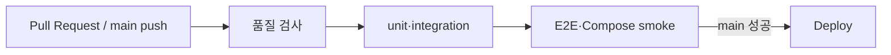

# 09. 테스트와 품질

## 먼저 생각해 보기

“화면에서 한 번 눌러 봤다”만으로 로그인과 배포가 안전하다고 말할 수 있을까?

## 핵심 해설

SourceWiki는 서로 다른 범위의 테스트를 겹쳐 사용한다.

| 종류 | 확인 대상 | 예 |
| --- | --- | --- |
| unit | 작은 함수·컴포넌트 | schema, token hash, UI 상태 |
| integration | API와 DB 규칙 | 가입→인증→로그인, 자료 권한 |
| E2E | 실제 브라우저 흐름 | 가입, Mailpit 인증 링크, CRUD |
| compose smoke | 컨테이너 전체 | Caddy 경유 health·OpenAPI |

GitHub Actions CI는 코드가 main에 들어가기 전 lint, typecheck, test, build, format 검사와 Compose smoke, 브라우저 E2E를 수행한다. 통과한 main 변경만 Deploy workflow가 이미지 생성과 운영 배포로 이어진다.

## 이해 점검

**Q. E2E가 unit test를 대체하지 않는 이유는?**  
**A.** E2E는 실제와 가깝지만 느리고 원인 찾기가 어렵다. 작은 규칙은 빠른 unit/integration test로 먼저 보장한다.

## 흔한 오해

CI 통과는 모든 운영 장애를 막는 보증이 아니다. DNS, SMTP 자격 증명, 클라우드 네트워크 같은 실제 환경 값은 별도 운영 점검이 필요하다.
