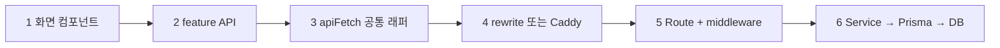
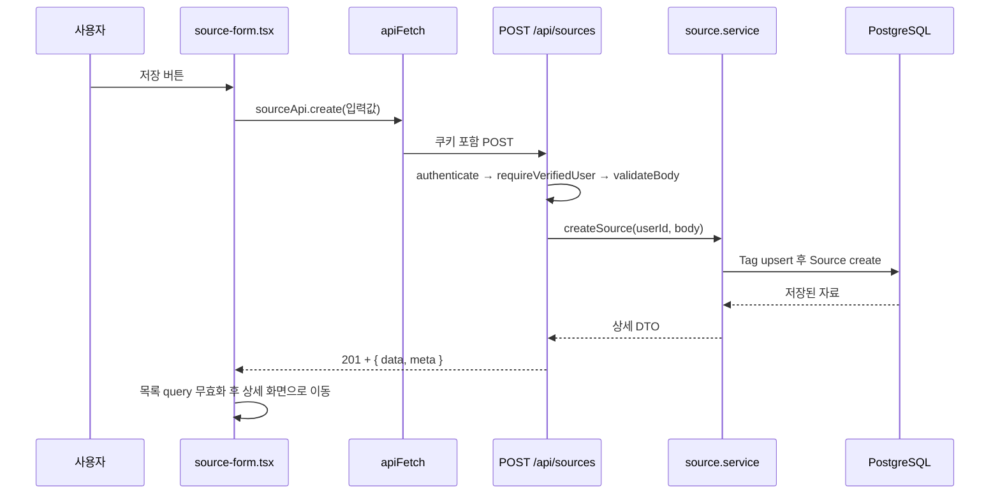
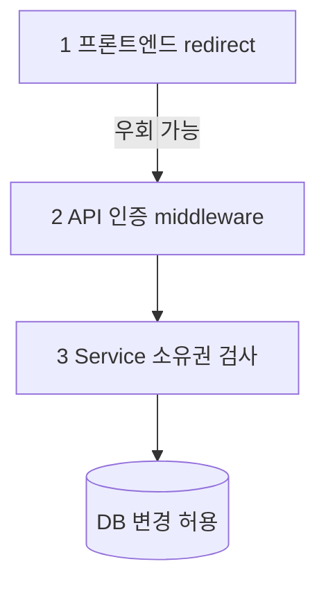

# 09b. 자료·댓글 CRUD 완전 추적

## 이 장에서 답할 수 있게 되는 것

- 과제의 "게시글 작성·조회·수정·삭제"가 이 프로젝트의 **어느 코드**인지
- 저장 버튼을 누르면 목록이 **어떻게 저절로 갱신되는지**
- 남의 글을 수정하려 하면 **정확히 어디에서 막히는지**

> **용어 매핑**: 과제의 "게시글"은 이 프로젝트의 **`Source`(자료)**, "댓글"은 **`Comment`**다. 질문자는 "게시글"이라고 물을 가능성이 높으니 이 대응을 먼저 말하고 시작한다.

## 먼저 생각해 보기

자료를 저장한 뒤 목록 화면으로 돌아왔을 때, 방금 만든 자료가 보이려면 무엇이 일어나야 할까? 화면을 통째로 새로고침하는 방법 말고 다른 방법이 있을까?

## 모든 CRUD가 지나가는 6단계

기능이 무엇이든 길은 같다. **이 여섯 칸을 외우면 어떤 기능이든 설명할 수 있다.**



| 칸 | 파일 |
| --- | --- |
| 1 | `apps/web/src/features/sources/source-form.tsx`, `source-list.tsx`, `source-detail-view.tsx` |
| 2 | `apps/web/src/features/sources/source-api.ts` |
| 3 | `apps/web/src/lib/api/api-client.ts` |
| 4 | `apps/web/next.config.ts`(개발) / `infra/Caddyfile`(Docker) |
| 5 | `apps/api/src/modules/sources/source.routes.ts` |
| 6 | `apps/api/src/modules/sources/source.service.ts` → `apps/api/prisma/schema.prisma` |

## 1. 생성 (Create)



**서버가 하는 일** (`createSource`):

1. 태그 이름을 정규화해 `Tag`를 `upsert`한다. 이미 있으면 그대로 쓰고 없으면 만든다.
2. `originalUrl`을 `new URL(...)`로 파싱해 `sourceDomain`(호스트 이름)을 따로 저장한다.
3. 본문 앞부분을 `rawTextPreview`로 잘라 목록 검색용으로 둔다.
4. `sourceTags`를 중첩 생성해 자료와 태그를 한 번에 연결한다.

**첨부 파일이 있으면** 자료를 만든 뒤 파일마다 `POST /api/sources/:id/files`를 따로 보낸다. 자료 ID가 있어야 파일을 붙일 수 있기 때문이다.

**응답이 201인 이유**: 새 리소스가 생겼기 때문이다. 200(단순 성공)과 구분해 "무엇이 만들어졌다"를 알린다.

## 2. 조회 (Read)

목록과 상세는 **서버가 먼저 가져와 화면에 심어 준다**([03b](./03b-server-rendering-and-hydration.md)). 클라이언트의 `useQuery`는 그 캐시를 이어받는다.

- 목록: `GET /api/sources` — `optionalAuthenticate`
- 상세: `GET /api/sources/:id` — `optionalAuthenticate`

`optionalAuthenticate`는 **쿠키가 있으면 누구인지 알아내고, 없으면 그냥 통과**시킨다. 덕분에 비로그인 방문자도 자료를 읽을 수 있으면서, 로그인한 사람에게는 "내가 좋아요를 눌렀는지", "내가 작성자인지" 같은 개인화된 값을 함께 줄 수 있다.

상세 응답에는 작성자, 태그, 좋아요 수와 내 좋아요 여부, 댓글 수, 관련 자료가 함께 담긴다. 화면 한 개를 위해 요청을 여러 번 보내지 않기 위해서다.

## 3. 수정 (Update)

**생성 폼과 수정 폼은 같은 파일이다.** `source-form.tsx`가 `id`를 받았는지로 갈린다.

```
mutationFn: id ? sourceApi.update(id, ...) : sourceApi.create(...)
```

수정 화면은 진입 시 `useQuery`로 기존 값을 불러와 폼에 채워 넣는다. 서버는 `PATCH /api/sources/:id`를 받아 **작성자 본인인지 먼저 확인한 뒤**에만 업데이트한다.

`PUT`이 아니라 `PATCH`인 이유: 자료 전체를 통째로 바꾸는 게 아니라 보내온 필드만 부분 수정하기 때문이다.

## 4. 삭제 (Delete)

`DELETE /api/sources/:id` → **204**. 성공했지만 돌려줄 본문이 없다는 뜻이다.

서버의 `deleteSource`는 순서가 중요하다.

1. 작성자 본인인지 확인한다.
2. 지울 자료에 붙은 파일들의 저장 이름을 **미리 조회해 둔다.**
3. `Source`를 삭제한다. 이때 댓글·파일 기록·태그 연결·좋아요는 DB의 `Cascade` 규칙으로 함께 사라진다([12장](./12-database-schema-atlas.md)).
4. **그다음에** 디스크에 있는 실제 파일을 지운다.

DB를 먼저 지우고 파일을 나중에 지우는 이유는, DB 삭제가 실패했는데 파일만 사라지는 상황을 피하기 위해서다.

## 저장 후 목록이 저절로 갱신되는 이유 — `invalidateQueries`

교재에서 가장 자주 나오는 질문이다. TanStack Query는 데이터를 **key**로 구분해 보관한다.

| 데이터 | query key |
| --- | --- |
| 자료 목록(전체) | `['sources']` |
| 특정 조건의 목록 | `['sources', { page, limit, q, tag, type }]` |
| 자료 상세 | `['source', id]` |
| 자료의 파일 목록 | `['source', id, 'files']` |
| 자료의 댓글 | `['comments', id]` |
| 로그인 사용자 | `['auth', 'me']` |

`sourceKeys` 객체(`apps/web/src/features/sources/source-api.ts`)가 이 key를 한곳에서 정의한다. 컴포넌트가 key 문자열을 직접 쓰지 않게 해서 오타로 캐시가 어긋나는 것을 막는다.

**핵심 규칙: 무효화는 앞에서부터 일치하면 함께 적용된다.**

- `['sources']`를 무효화하면 `['sources', {page:1}]`, `['sources', {page:2, tag:'react'}]` 등 **모든 조건의 목록**이 함께 무효화된다. 그래서 자료를 저장할 때 필터 조건을 몰라도 목록 전체를 갱신할 수 있다.
- `['source', id]`를 무효화하면 `['source', id, 'files']`도 앞부분이 같으므로 함께 무효화된다.
- 반면 `['comments', id]`는 뿌리가 달라 상세를 무효화해도 포함되지 않는다. 그래서 댓글을 달면 `comments`·`detail`·`lists`를 **각각** 무효화한다(`comments-panel.tsx`).

### `invalidateQueries`와 `setQueryData`의 차이

| | `invalidateQueries` | `setQueryData` |
| --- | --- | --- |
| 하는 일 | "이 데이터는 낡았다"고 표시해 **다시 가져오게** 함 | 캐시 값을 **즉시 덮어씀** |
| 서버 요청 | 발생함 | 발생하지 않음 |
| 쓰는 곳 | 자료 저장·삭제·댓글 작성 후 목록 갱신 | 로그인 성공 시 `['auth','me']`, 서버 렌더링 프리필 |

로그인 직후 헤더의 닉네임이 **깜빡임 없이 바로** 바뀌는 이유가 이것이다. 로그인 응답에 이미 사용자 정보가 들어 있으므로 다시 물어볼 필요 없이 `setQueryData`로 덮어쓴다.

## 권한은 세 겹이다



| 겹 | 위치 | 막는 것 | 실패 시 |
| --- | --- | --- | --- |
| 1. 화면 | `source-form.tsx`의 `useEffect` redirect | 로그인 안 한 사람이 작성 화면을 여는 것 | 로그인 페이지로 이동 |
| 2. 신원 | `authenticate` → `requireVerifiedUser` | 쿠키 없음 / 이메일 미인증 | 401 · 403 `EMAIL_NOT_VERIFIED` |
| 3. 소유권 | `source.service.ts`의 `assertOwner` | **남의 자료를 고치는 것** | 404 `SOURCE_NOT_FOUND` · 403 `FORBIDDEN` |

`assertOwner`는 자료를 조회해 `source.userId`와 요청자를 비교한다. 자료가 없으면 404, 남의 것이면 403이다. 댓글은 `comment.service.ts`가, 파일은 `file.service.ts`가 같은 방식으로 각자 확인한다.

**"버튼을 숨겼으니 안전하다"는 틀린 설명이다.** 1번은 편의이고, 개발자 도구로 API를 직접 부를 수 있으므로 2·3번이 실제 방어선이다.

## 댓글은 무엇이 다른가

| 항목 | 자료 | 댓글 |
| --- | --- | --- |
| 목록 | 페이징함 | **전부 반환**(`listComments`) |
| 정렬 | 최신순(`createdAt desc`) | 오래된 순(`createdAt asc`) — 대화 순서 |
| 수정·삭제 경로 | `/api/sources/:id` | `/api/comments/:id`(자료 경로가 아님) |
| 권한 | 자료 작성자 | 댓글 작성자 |

댓글 작성은 `/api/sources/:id/comments`(자료에 속한 행위)인데 수정·삭제는 `/api/comments/:id`(댓글 자체를 지목)인 점이 다르다. 댓글 ID만 알면 어느 자료인지는 서버가 안다.

## 이해 점검

**Q. 자료 저장 후 `['sources']`만 무효화해도 되는 이유는?**
**A.** 앞부분이 일치하면 함께 무효화되므로, 어떤 필터·페이지의 목록이 열려 있든 모두 갱신 대상이 된다.

**Q. 로그아웃 상태로 `PATCH /api/sources/:id`를 직접 호출하면?**
**A.** `authenticate`에서 401로 막힌다. 로그인은 했지만 남의 자료라면 `assertOwner`에서 403이다.

**Q. 삭제가 204인데 화면은 어떻게 목록으로 돌아가는가?**
**A.** 응답 본문이 없어도 성공은 성공이다. `onSuccess`에서 목록을 무효화하고 `router.push('/sources')`로 이동한다.

## 흔한 오해

"생성과 수정은 화면이 다르니 코드도 다르다"고 생각하기 쉽지만, 이 프로젝트는 **한 파일에서 `id` 유무로 분기**한다. 폼의 검증 규칙과 오류 표시를 두 벌 관리하지 않기 위해서다.

---

다음 장 → [09c. 페이징·검색·파일 업로드](./09c-pagination-search-and-files.md)
