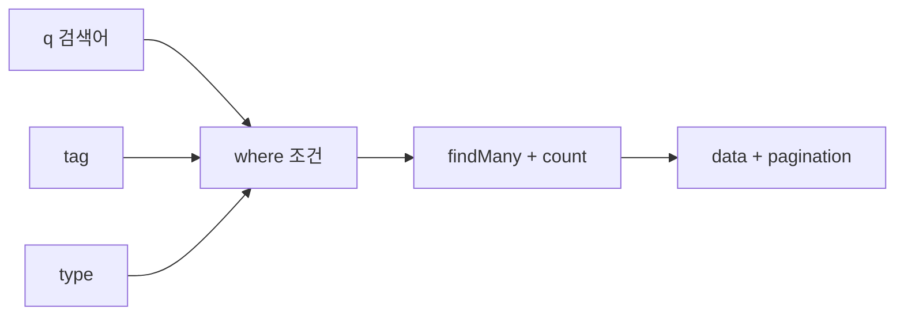

# 09c. 페이징·검색·파일 업로드

## 이 장에서 답할 수 있게 되는 것

- 목록을 나눠 가져오는 방식과 그 **한계**
- 검색·태그·종류 필터가 하나의 쿼리로 합쳐지는 방식
- 파일은 왜 JSON이 아니라 `FormData`로 보내는가

## 먼저 생각해 보기

자료가 1만 개라면 목록 화면은 어떻게 해야 할까? 전부 내려받아 화면에서 자르면 무엇이 문제일까?

## 1. 페이징

문제는 **서버와 네트워크**다. 1만 개를 다 보내면 DB 조회도 느리고 전송량도 크며 브라우저 메모리도 낭비된다. 그래서 **필요한 만큼만 잘라서** 준다.

### 요청 — 무엇을 보내는가

`packages/shared/src/index.ts`의 `paginationQuerySchema`가 규칙이다.

| 값 | 규칙 | 기본값 |
| --- | --- | --- |
| `page` | 1 이상의 정수 | `1` |
| `limit` | 1~50 사이의 정수 | `12` |

URL의 쿼리 문자열은 항상 문자열(`"2"`)이므로 `z.coerce`로 숫자로 바꾼다. `limit`에 상한 50을 둔 이유는 **누군가 `limit=100000`을 보내 서버를 무겁게 만드는 것을 막기 위해서**다. 검증에 실패하면 422로 거절한다.

### 서버 — 어떻게 자르는가

`apps/api/src/modules/sources/source.service.ts`의 `listSources`:

```
prisma.$transaction([
  findMany({ skip: (page - 1) * limit, take: limit, orderBy: [createdAt desc, id desc] }),
  count(),
])
```

- `skip`은 앞에서 건너뛸 개수, `take`는 가져올 개수다. 3페이지에 12개씩이면 24개를 건너뛰고 12개를 가져온다.
- **목록과 총개수를 한 트랜잭션으로 함께** 조회한다. 따로 조회하는 사이에 자료가 추가되면 "총 25개인데 마지막 페이지가 비어 있는" 어긋남이 생길 수 있다.
- 정렬이 `[createdAt desc, id desc]`인 이유: 같은 시각에 만들어진 자료가 있으면 순서가 매번 달라져 **같은 자료가 두 페이지에 나오거나 아예 빠질 수 있다.** `id`를 두 번째 기준으로 두면 순서가 항상 고정된다. 이 정렬은 `12`장의 인덱스 `[createdAt desc, id desc]`와 같은 순서라 DB가 정렬 작업 없이 바로 읽는다.

### 응답 — 화면이 무엇을 받는가

```
{ data: [...], pagination: { page, limit, totalItems, totalPages }, meta: { requestId } }
```

`totalPages`는 `Math.ceil(totalItems / limit)`로 서버가 계산해 준다. 화면이 직접 계산하지 않게 해서 페이지 버튼을 그리기 쉽게 만든다.

### offset 방식의 한계

이 프로젝트는 **offset(건너뛰기) 방식**이다. 장점은 "5페이지로 바로 가기"가 쉽다는 것이고, 단점은 **뒤로 갈수록 느려진다**는 것이다. 1000페이지를 보려면 DB가 앞의 11,988개를 세어 건너뛰어야 한다. 또 내가 보는 동안 새 자료가 추가되면 항목이 밀려 다음 페이지에서 중복으로 보일 수 있다.

대안은 **cursor(keyset) 방식**이다. "마지막으로 본 항목 다음부터"를 조건으로 걸어 건너뛰기 자체를 없앤다. 지금 자료 수에서는 offset으로 충분하고, 이미 `[createdAt desc, id desc]` 인덱스가 있어 나중에 cursor로 바꾸기도 어렵지 않다.

> 페이징이 적용된 곳은 **자료 목록**과 **사용자별 자료 목록** 두 곳이다. 댓글은 한 자료에 달리는 수가 적다고 보고 전부 반환한다.

## 2. 검색과 필터

같은 요청에 검색어와 필터가 함께 실린다. `sourceListQuerySchema`가 페이징 스키마를 확장한 형태다.

| 값 | 뜻 | 길이 제한 |
| --- | --- | --- |
| `q` | 검색어 | 100자 |
| `tag` | 태그 이름 | 30자 |
| `type` | 자료 종류(article/docs/paper/github/other) | 정해진 값만 |

빈 문자열은 `undefined`로 전처리한다. 사용자가 검색창을 비우면 `q=`가 붙는데, 이를 "빈 문자열로 검색"이 아니라 **"검색 조건 없음"**으로 해석해야 하기 때문이다.

서버의 `sourceListWhere`는 이 값들을 **AND로 쌓는다.** 검색어 하나는 제목·요약·본문 미리보기·도메인 네 곳을 대소문자 구분 없이 `OR`로 찾고, 태그는 정규화된 이름으로 연결 테이블을 통해 찾는다.



같은 `where`를 목록 조회와 개수 세기에 **똑같이** 넘긴다. 조건이 다르면 "3페이지가 있다고 했는데 2페이지에서 끝나는" 상황이 생긴다.

## 3. 파일 업로드

### 왜 JSON이 아닌가

JSON은 글자만 담을 수 있는 형식이다. 이미지나 PDF는 글자가 아니어서 JSON에 넣으려면 문자로 바꿔야 하고, 그러면 용량이 30% 이상 늘어난다. 그래서 파일은 **`FormData`(multipart)** 로 보낸다. 소포를 편지봉투가 아니라 상자에 담는 것과 같다.

`sourceApi.uploadFile`은 `FormData`를 만들어 `POST /api/sources/:id/files`로 보낸다.

### `Content-Type`을 직접 설정하지 않는 이유

`apps/web/src/lib/api/api-client.ts`는 body가 `FormData`이면 `Content-Type`을 **일부러 설정하지 않는다.** multipart는 각 파일의 경계를 표시하는 `boundary` 문자열이 헤더에 들어가야 하는데, 그 값은 브라우저가 만든다. 사람이 헤더를 직접 쓰면 boundary가 빠져 서버가 파싱하지 못한다.

### 서버가 검사하는 것

`apps/api/src/modules/files/file.service.ts`:

| 검사 | 규칙 | 실패 시 |
| --- | --- | --- |
| 크기 | 10MB 이하 | 413 `FILE_TOO_LARGE` |
| 확장자·형식 | `.pdf .txt .md .png .jpg .jpeg .webp`만, 확장자와 MIME이 **짝이 맞아야** 함 | 415 `FILE_TYPE_UNSUPPORTED` |
| 권한 | 그 자료의 작성자만 | 403 `FORBIDDEN` |

스트림 단계에서 11MB를 넘으면 읽기 자체를 중단한다. 10MB 제한보다 조금 크게 잡아 두어, 거대한 파일을 끝까지 메모리에 올리지 않고 잘라 낸다.

확장자와 MIME을 **함께** 보는 이유는 `.png`로 이름만 바꾼 실행 파일을 걸러 내기 위해서다.

저장할 때는 원래 이름을 그대로 쓰지 않고 **UUID로 새 이름**을 만든다. 같은 이름 파일이 서로 덮어쓰는 것, 이름에 섞인 경로 문자로 다른 폴더에 쓰이는 것을 막는다. 원래 이름은 DB에 따로 보관해 다운로드할 때 되돌려 준다.

실제 파일은 `UPLOAD_DIR`에 저장되고, 이 경로는 Docker에서 볼륨으로 연결돼 **컨테이너를 다시 만들어도 파일이 남는다**([13장](./13-docker-and-local-environment.md)).

## 이해 점검

**Q. `limit` 상한을 두지 않으면 어떤 일이 생기는가?**
**A.** 한 번의 요청으로 전체 자료를 가져갈 수 있어 DB와 서버에 부담이 된다. 상한은 성능 문제이자 보호 장치다.

**Q. 정렬 기준이 `createdAt` 하나뿐이면 무엇이 문제인가?**
**A.** 같은 시각의 자료 순서가 조회마다 달라져 페이지 경계에서 항목이 중복되거나 누락될 수 있다.

**Q. 자료를 지우면 첨부 파일은 어떻게 되는가?**
**A.** DB의 파일 기록은 `Cascade`로 함께 지워지고, 디스크의 실제 파일은 서버가 삭제 후 따로 지운다.

## 흔한 오해

"페이징은 화면에서 잘라 보여 주는 것"이라는 설명은 틀리다. 화면에서 자르면 **이미 전부 내려받은 뒤**라서 서버·네트워크 부담이 그대로다. 페이징의 목적은 **서버가 필요한 만큼만 읽고 보내는 것**이다.

---

다음 장 → [10. 화면·기능 코드 지도](./10-screen-feature-code-map.md)
