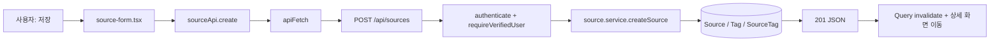

# 10. 화면·기능 코드 지도

## 이 장에서 답할 수 있게 되는 것

- "이 버튼을 누르면 어디 코드가 움직이나요"에 답하기
- 화면에서 막는 것과 API에서 막는 것의 차이

## 먼저 생각해 보기

발표 중 “이 버튼을 누르면 어디 코드가 움직이나요?”라는 질문을 받았을 때, 화면 파일 하나만 말하면 충분할까?

충분하지 않다. 프론트엔드 기능은 보통 **페이지 → feature 컴포넌트 → feature API → 공통 API → backend router → service → DB**의 연결이다. 이 표는 그 길의 시작점이다.

## 페이지 지도

| 사용자가 보는 경로 | 중심 Web 파일 | 서버 상태/지역 상태 | 핵심 API | 서버의 최종 책임 |
| --- | --- | --- | --- | --- |
| `/` | `app/page.tsx` | 목록 query | `sourceApi.list` | 자료 목록·필터·페이지네이션 |
| `/signup` | `features/auth/signup-form.tsx` | React Hook Form | `authApi.signup` | 계정·인증 토큰·SMTP 발송 |
| `/verify-email` | `verify-email-result.tsx` | token 처리 상태 | `authApi.verifyEmail` | 토큰 hash·만료·사용 여부 검사 |
| `/login` | `login-form.tsx` | React Hook Form, `['auth','me']` | `authApi.login` | 비밀번호·이메일 인증 검사, 쿠키 설정 |
| `/profile` | `users/profile-form.tsx` | `useMeQuery`, mutation | `userApi.updateMe` | 로그인·인증 사용자 프로필 수정 |
| `/sources/new` | `sources/source-form.tsx` | 폼, 파일, 추출 미리보기 | `sourceApi.create` | 자료 작성자·입력 규칙 확인 |
| `/sources/:id/edit` | `sources/source-form.tsx` | 상세 query, 폼 | `sourceApi.detail/update` | 작성자 소유권 확인 |
| `/sources/:id` | `source-detail-view.tsx` | 상세/댓글/파일 query | source·comment·file API | 공개 읽기와 변경 권한 구분 |
| `/users/:id` | `app/users/[id]/page.tsx` | 서버 API 읽기 | `userApi.profile/sources` | 공개 프로필·자료 목록 |

## 한 기능을 추적하는 읽는 순서

### 예: 자료 생성

1. `source-form.tsx`에서 `useMutation`의 `mutationFn`, `onSuccess`, `onError`를 찾는다.
2. `source-api.ts`에서 method와 request type을 본다.
3. `api-client.ts`에서 쿠키·timeout·오류 변환의 공통 규칙을 확인한다.
4. `source.routes.ts`에서 필요한 middleware와 schema를 본다.
5. `source.service.ts`에서 소유권·태그 처리 같은 업무 규칙을 읽는다.
6. `schema.prisma`에서 변경되는 모델과 관계를 연결한다.

## 화면 보호를 논리적으로 구분하기

프로필/자료 작성 폼은 `useMeQuery`가 `null`이면 로그인 화면으로 보낸다. 이것은 **사용자 경험**이다. 개발자 도구에서 API를 직접 호출할 수 있으므로, 보안은 API의 `authenticate`, `requireVerifiedUser`, service의 작성자 확인으로 완성된다.

| 질문 | 올바른 답 |
| --- | --- |
| 로그인 안 했는데 `/sources/new` 주소를 열면? | 프론트가 로그인 화면으로 이동시킨다. |
| 그 redirect를 우회하면? | API가 access cookie와 이메일 인증을 다시 검사한다. |
| 다른 사람 자료 수정 API를 직접 호출하면? | service의 소유권 확인이 거부해야 한다. |

## 자기 점검

- 로그인 성공 뒤 헤더 닉네임이 즉시 바뀌는 이유를 `queryClient.setQueryData`까지 설명할 수 있는가?
- 파일 업로드가 JSON이 아니라 FormData인 이유를 설명할 수 있는가?
- “프론트에서 막는다”와 “API에서 막는다”의 차이를 말할 수 있는가?

---

다음 장 → [11. API 계약 사전](./11-api-contract-atlas.md)
