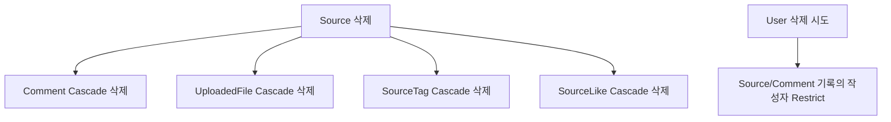

# 12. DB 스키마 완전 해설

## 이 장에서 답할 수 있게 되는 것

- 테이블 관계를 어떤 기준으로 설계했는가
- Cascade와 Restrict를 나눈 기준

## 먼저 생각해 보기

테이블 이름만 아는 것과, 어떤 column이 왜 unique/index/relation인지 설명하는 것은 다르다. 평가에서 관계 질문을 받으면 데이터가 이동하는 방식으로 설명해야 한다.

## 모델별 책임

| 모델 | 핵심 column | 관계/제약 | 설계 이유 |
| --- | --- | --- | --- |
| `User` | email unique, passwordHash, emailVerifiedAt | Source/Comment/Session의 부모 | 로그인 ID 중복 금지, 인증 상태 분리 |
| `Source` | userId, URL, rawText, summary, 상태값 | 댓글·파일·태그·좋아요의 부모 | 자료 하나의 모든 맥락 보관 |
| `Comment` | sourceId, userId, content | Source/User에 N:1 | 누가 어느 자료에 썼는지 보존 |
| `Tag` | normalizedName unique | SourceTag와 N:M | 대소문자/공백 차이 중복 방지 |
| `SourceTag` | sourceId+tagId 복합 PK | 두 부모에 N:1 | 같은 태그를 같은 자료에 두 번 연결 금지 |
| `SourceLike` | userId+sourceId 복합 PK | User/Source N:M | 한 사용자의 중복 좋아요 금지 |
| `UploadedFile` | storedName unique, MIME, 크기 | Source/User N:1 | 파일 메타데이터와 실제 저장 이름 분리 |
| `EmailVerificationToken` | tokenHash unique, expiresAt, usedAt | User N:1 | 원문 비보관, 일회성·만료 보장 |
| `RefreshSession` | tokenHash unique, familyId, revokedAt | User N:1, self relation | rotation·재사용 탐지 |

## 인덱스는 왜 있는가?

인덱스는 자주 찾거나 정렬하는 column을 빠르게 찾는 목차다. 예를 들어 Source의 `[createdAt desc, id]`는 최신 자료 목록과 안정적인 페이지네이션에, Comment의 `[sourceId, createdAt, id]`는 한 자료의 댓글 시간순 조회에 맞춘다. 모든 column에 인덱스를 걸면 쓰기 비용과 저장 공간이 늘어 오히려 좋지 않다.

## 삭제 정책을 스토리로 설명하기

자료가 없어지면 그 자료에만 의미 있던 파일·댓글·좋아요 연결도 사라지는 것이 자연스럽다. 반면 User를 지울 때 작성자 기록을 무조건 지우면 자료/댓글의 보존 정책이 불명확해져 Restrict를 택했다. 이는 기술 문제가 아니라 제품 정책이다.

## enum은 왜 쓰는가?

`SourceType`, `ExtractionStatus`, `SummaryStatus`는 문자열 오타를 DB 수준에서 막고 화면/서비스가 가능한 상태를 공유하게 한다. 예를 들어 `summaryStatus=demo`는 실제 AI 결과처럼 오해되지 않도록 현재 결과의 성격을 남긴다.

## 자기 점검

- Tag의 `name`과 `normalizedName`을 분리한 이유를 설명할 수 있는가?
- `SourceLike`에 별도 id 대신 복합 PK를 쓴 이유를 설명할 수 있는가?
- migration과 seed가 각각 어느 환경에 필요한지 말할 수 있는가?

---

다음 장 → [13. Docker와 로컬 환경](./13-docker-and-local-environment.md)
