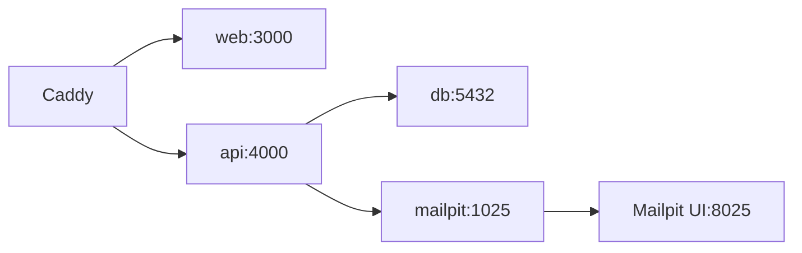

# 13. Docker와 로컬 환경

## 먼저 생각해 보기

내 컴퓨터와 CI 서버에서 같은 DB·메일 환경을 만들려면 무엇을 복사해야 할까?

## 핵심 해설

Docker는 프로그램과 필요한 실행 환경을 컨테이너로 묶는다. Docker Compose는 여러 컨테이너를 하나의 서비스 묶음으로 선언한다.

로컬 Compose에는 `web`, `api`, `db`, `mailpit`, `caddy`가 있다. 컨테이너끼리는 서비스 이름(`db`, `api`, `mailpit`)으로 통신한다. 사용자는 Caddy의 한 포트로만 접근한다.

| 개념 | 프로젝트의 예 |
| --- | --- |
| 이미지 | PostgreSQL, Caddy, Web/API 실행 환경 |
| 컨테이너 | 실제로 실행 중인 한 인스턴스 |
| 볼륨 | DB 데이터·업로드 파일을 컨테이너 밖에도 유지 |
| health check | 준비된 DB/API/Web만 다음 서비스가 사용 |
| Compose | 서비스 관계와 환경변수 선언 |

운영 Compose는 로컬 Mailpit을 포함하지 않고 실제 SMTP와 Azure PostgreSQL을 쓴다.

## 이해 점검

**Q. 컨테이너를 다시 만들어도 DB 데이터가 남는 이유는?**  
**A.** PostgreSQL 데이터가 named volume에 보관되기 때문이다. 단, 볼륨까지 지우면 데이터도 사라질 수 있다.

## 흔한 오해

Docker는 클라우드 자체가 아니다. 같은 실행 방식을 로컬·CI·VM에서 재현하도록 돕는 도구다.
