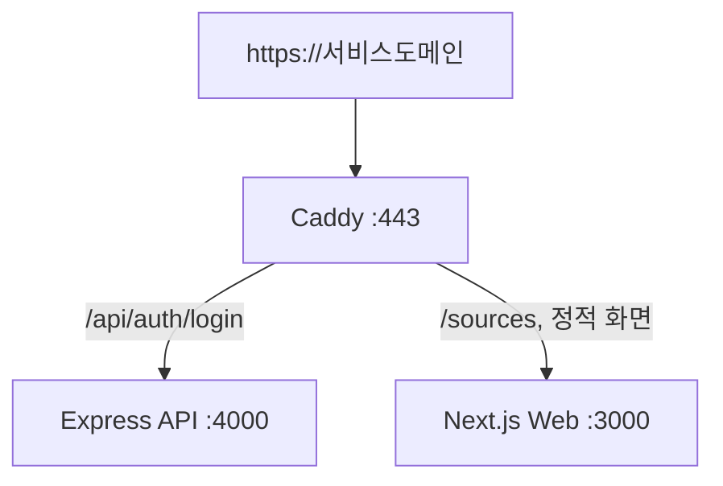

# 14. Caddy와 네트워크

## 이 장에서 답할 수 있게 되는 것

- 포트가 여러 개인데 주소는 왜 하나인가
- reverse proxy가 실제로 하는 일

## 먼저 생각해 보기

Web은 3000번, API는 4000번 포트인데 사용자는 왜 하나의 HTTPS 주소만 사용해도 될까?

## 핵심 해설

Caddy는 reverse proxy다. 외부 요청을 먼저 받은 뒤 경로에 따라 내부 서비스로 전달한다. 운영 Caddyfile은 `/api/*`를 API로, 그 밖의 요청을 Web으로 보낸다.

이 구조의 장점은 브라우저 관점에서 same-origin을 유지한다는 것이다. 쿠키와 CORS 설정이 단순해지고, 내부 포트 3000·4000을 외부에 직접 공개하지 않아도 된다. Caddy는 HTTPS 인증서도 자동 관리한다.

## 이해 점검

**Q. reverse proxy가 API 코드를 복사하는가?**  
**A.** 아니다. 요청을 적절한 내부 주소로 전달할 뿐이고, 업무 규칙은 여전히 Express API가 처리한다.

## 흔한 오해

`localhost`는 실행 위치에 따라 다르다. API 컨테이너 안의 localhost는 Web 컨테이너나 VM 자체가 아니다. 컨테이너 간에는 서비스 이름을 쓴다.

---

다음 장 → [15. 테스트와 품질](./15-testing-and-quality.md)
