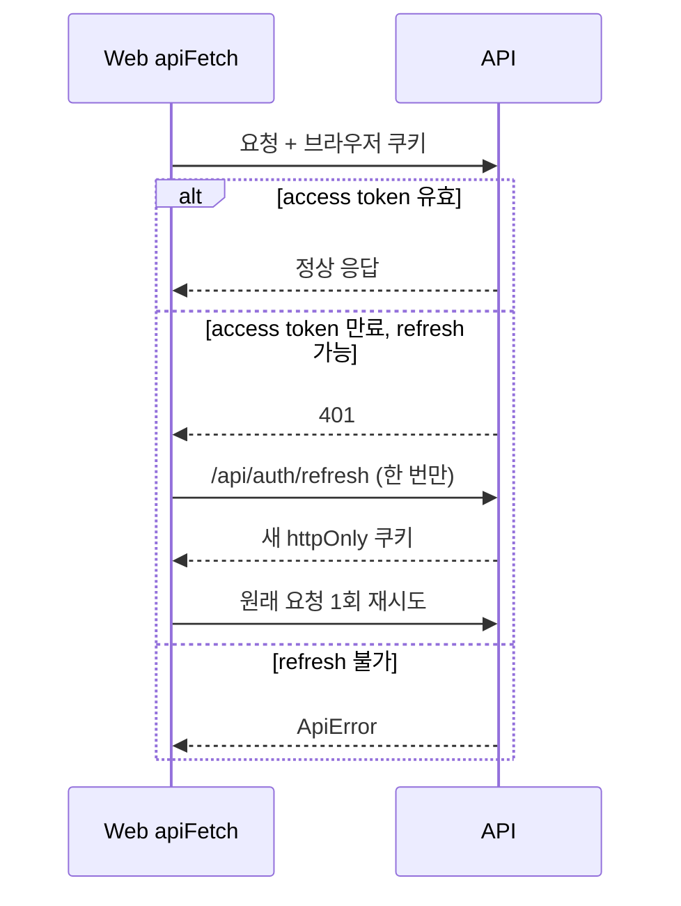

# 14. Frontend API·에러·인증 심화

## 먼저 생각해 보기

모든 컴포넌트가 각자 `fetch`를 쓰면 토큰 만료, timeout, 오류 메시지를 일관되게 처리할 수 있을까?

## API 호출 구조

```mermaid
flowchart LR
  C[폼·화면 컴포넌트] --> F[feature API: authApi/sourceApi/userApi]
  F --> G[apiFetch 공통 래퍼]
  G -->|same-origin, cookies include| P[/api/*]
  P --> X[Next.js 개발 proxy 또는 운영 Caddy]
  X --> A[Express API]
```

컴포넌트는 `authApi.login`처럼 기능 언어로 요청한다. URL·HTTP method·body는 `auth-api.ts`, `source-api.ts`, `user-api.ts`가 맡고, 모든 브라우저 요청의 공통 규칙은 `apps/web/src/lib/api/api-client.ts`의 `apiFetch`가 담당한다. 이 구조는 API 주소나 오류 처리가 바뀌어도 각 화면을 일일이 고치지 않게 한다.

## 토큰은 어떻게 전달되는가?

로그인 API가 access/refresh JWT를 `httpOnly` 쿠키로 설정한다. 프론트엔드는 `credentials: 'include'`로 같은 도메인 요청에 쿠키가 자동 포함되게 할 뿐, Authorization header를 직접 만들거나 토큰을 localStorage에 저장하지 않는다.



여러 요청이 동시에 401이 되어도 `refreshPromise` 하나를 공유한다. 각 요청이 동시에 refresh를 보내 refresh token 재사용으로 세션이 끊기는 문제를 막는다. 로그인·refresh·logout 자체는 refresh 재시도 대상에서 제외한다.

## 에러 처리는 어떻게 하는가?

API는 오류 JSON에 상태 코드, `code`, 사람이 읽을 `message`, 선택적 `fieldErrors`, `requestId`를 보낸다. `apiFetch`는 이를 `ApiError` 객체로 변환한다.

| 오류 종류 | 화면 처리 예 |
| --- | --- |
| 검증 오류 422 + `fieldErrors` | `source-form`이 해당 필드에 오류 문구 표시 |
| 로그인 실패/미인증 | `login-form`이 root 오류와 메일 재전송 링크 표시 |
| 네트워크/예상 밖 오류 | 사용자에게 연결 확인 안내 |
| timeout | `AbortController`가 `REQUEST_TIMEOUT`으로 변환 |

`apiFetch`는 일반 JSON이면 Content-Type을 설정하지만 FormData 파일 업로드에는 브라우저가 boundary를 붙일 수 있게 직접 설정하지 않는다. HTTP 204는 body가 없으므로 `undefined`를 반환한다.

## 로그인 상태와 접근 제어

새로고침 뒤에도 쿠키는 브라우저에 남고, `useMeQuery`가 `/api/auth/me`를 다시 요청해 로그인 사용자를 복구한다. 프로필과 자료 작성 폼은 사용자가 없으면 `returnTo`가 든 로그인 화면으로 client-side redirect한다.

하지만 이것은 UX 제어다. 진짜 권한 제어는 API의 `authenticate`, `requireVerifiedUser`, 작성자 소유권 검증이 한다. 사용자가 주소를 직접 입력하거나 API를 직접 호출해도 API가 막아야 한다.

## 발표 답변 카드

### API 요청은 어떻게 관리했나요?

**30초 답변:** “기능별 API 모듈과 공통 `apiFetch`를 분리했습니다. 컴포넌트는 `sourceApi.create` 같은 업무 단위 함수를 호출하고, 공통 래퍼가 쿠키 포함, JSON/FormData 처리, timeout, 오류 변환, 토큰 갱신 후 1회 재시도를 담당합니다.”

### 인증 토큰은 어떻게 전달하나요?

**답변:** “로그인 응답에서 서버가 httpOnly 쿠키를 설정하고, 프론트는 `credentials: 'include'`로 브라우저가 쿠키를 보내게 합니다. 토큰을 localStorage에 저장하지 않아 XSS로 읽히는 위험을 줄였습니다.”

### 토큰이 만료되면 어떻게 되나요?

**답변:** “일반 API가 401이면 공통 래퍼가 refresh endpoint를 한 번 호출해 새 쿠키를 받고 원래 요청을 한 번 재시도합니다. refresh 실패면 `ApiError`로 넘기고 화면은 비로그인/오류 상태를 표시합니다. 동시에 여러 요청이 있어도 refresh Promise를 공유합니다.”

### 공통 에러 처리는 어떻게 했나요?

**답변:** “백엔드 오류 응답을 `ApiError`로 표준화했습니다. status, code, message, fieldErrors, requestId를 가지고 있어 화면은 필드 오류와 일반 오류를 구분할 수 있습니다.”

## 이해 점검

**Q. `httpOnly` 쿠키를 쓰면 JavaScript로 토큰을 읽을 수 없는 것이 불편하지 않은가?**  
**A.** 읽지 못하게 하는 것이 목적이다. 프론트는 토큰 원문이 아니라 `/me`의 사용자 정보로 로그인 상태를 판단한다.

## 현재 구현의 한계와 개선 방향

현재 보호 화면은 client-side redirect라 화면이 잠깐 로딩될 수 있다. 더 강한 UX가 필요하면 Next.js middleware나 서버 컴포넌트 단계의 redirect를 추가할 수 있다. 다만 API 권한 검증은 계속 최종 방어선이어야 한다.
