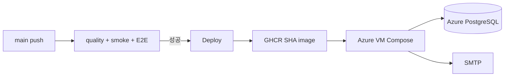

# 16. 개발·CI·운영 환경 비교

## 이 장에서 답할 수 있게 되는 것

- 개발·CI·운영은 무엇이 다른가
- 환경이 바뀔 때 어떤 값이 달라지는가

## 먼저 생각해 보기

“Docker를 사용했다”는 말만으로 로컬, CI, Azure가 같은 방식이라고 할 수 있을까? 아니다. 같은 코드라도 의존 서비스와 비밀값, 진입점이 달라진다.

| 구분 | Web/API 실행 | DB | 메일 | 외부 진입점 | 목적 |
| --- | --- | --- | --- | --- | --- |
| Hybrid 개발 | 로컬 Node.js | Docker PostgreSQL | Docker Mailpit | Next.js 개발 서버 | 빠른 수정 |
| 전체 Docker | Docker Web/API | Docker PostgreSQL volume | Docker Mailpit | Caddy HTTP | 운영과 유사한 smoke |
| CI quality | test process | GitHub service PostgreSQL | fake/테스트 | 없음 | lint/type/test/build |
| CI E2E | 로컬 dev process | Docker PostgreSQL | Mailpit API | Playwright browser | 실제 가입 흐름 |
| Azure 운영 | GHCR Docker image | Azure PostgreSQL | 실제 SMTP | Caddy HTTPS | 실제 사용자 서비스 |

## 환경에 따라 바뀌는 핵심

### DB 주소

컨테이너 내부에서는 `db:5432`처럼 Compose 서비스 이름을 쓸 수 있다. Azure 운영은 같은 Docker network DB가 아니라 Azure PostgreSQL의 호스트를 `DATABASE_URL`에 쓴다. DBeaver가 연결한 DB와 API의 `DATABASE_URL`이 같은 database/schema인지 따로 확인해야 한다.

### 메일

Mailpit은 어떤 수신 주소든 실제 인터넷으로 보내지 않고 개발 UI에 보여 준다. 운영은 Gmail SMTP로 실제 수신자에게 보내므로 `SMTP_USER`, `SMTP_FROM`, 16자리 앱 비밀번호가 필요하다. 이 차이 때문에 운영에서 Mailpit UI를 찾으면 안 된다.

### 이미지와 배포

Deploy workflow는 main CI 성공 뒤 Web/API 이미지를 GHCR에 Git SHA로 push한다. VM은 그 image를 pull하고, migration을 실행한 뒤 Compose를 올린다. SHA 태그는 “어느 코드 버전을 실행하는가”를 고정하고 rollback 판단을 돕는다.

## 운영 문제를 계층으로 분리하기

| 증상 | 우선 가설 | 증거 |
| --- | --- | --- |
| DBeaver에는 테이블 없음 | 다른 database 연결 | 현재 database/schema 확인 |
| signup 503 | DB 뒤 SMTP 단계 실패 | users row, SMTP 설정 길이/host |
| API가 시작 안 됨 | 필수 env 또는 DB URL | Compose 상태·API log |
| 화면은 열리지만 API 실패 | Caddy 경로/쿠키/API health | `/api/health`와 네트워크 요청 |

## 자기 점검

운영 `.env.production`에 비밀값이 있지만 GitHub workflow가 이를 VM에 덮어쓰면 안 되는 이유를 설명해 보라. 비밀은 VM의 안전한 파일/secret에만 두고, image와 코드와 분리해야 한다.

---

다음 장 → [17. Azure 배포와 운영](./17-cloud-deployment-and-operations.md)
