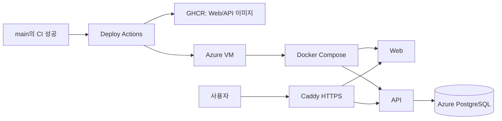

# 17. Azure 배포와 운영

## 먼저 생각해 보기

내 컴퓨터에서 만든 코드는 어떻게 Azure VM에서 HTTPS 서비스가 되고, DB는 왜 VM 밖 Azure PostgreSQL에 둘까?

## 핵심 해설

현재 운영 흐름은 GitHub Actions, GHCR, Azure VM, Azure PostgreSQL을 연결한다. 소스 코드를 VM에서 직접 빌드하는 대신 CI가 불변 이미지 태그를 만들고 VM은 해당 이미지를 실행한다.

| 운영 구성 | 역할 |
| --- | --- |
| GitHub Actions | 검사, 이미지 build/push, VM 배포 자동화 |
| GHCR | Git commit SHA가 붙은 Web/API 이미지 보관 |
| Azure VM | Caddy, Web, API 컨테이너 실행 |
| Azure PostgreSQL | 운영 영구 데이터 저장 |
| `.env.production` | DB, JWT, SMTP, 도메인 등 비밀 설정 |

배포 중 migration은 Azure PostgreSQL에 아직 적용되지 않은 테이블 구조만 적용한다. `No pending migrations`는 오류가 아니라 이미 최신 구조라는 뜻이다. 운영 DB는 seed 데이터가 없을 수 있다.

운영에서 실제 메일 인증은 Mailpit이 아니라 SMTP로 수신자의 받은편지함에 도착해야 한다. 환경변수의 비밀값은 Git·문서·스크린샷에 남기지 않는다.

## 이해 점검

**Q. VM에서 Compose 상태 확인에도 이미지 변수가 필요한 이유는?**  
**A.** 운영 Compose는 어떤 GHCR API/Web 이미지를 사용할지 환경변수로 받기 때문이다. 상태 확인도 Compose가 설정을 해석하는 과정이므로 그 값이 필요하다.

## 흔한 오해

Azure PostgreSQL에 DBeaver로 연결되는 것과 API가 같은 DB를 쓰는 것은 별개의 확인이다. API의 `DATABASE_URL`이 동일한 데이터베이스를 가리켜야 한다.
