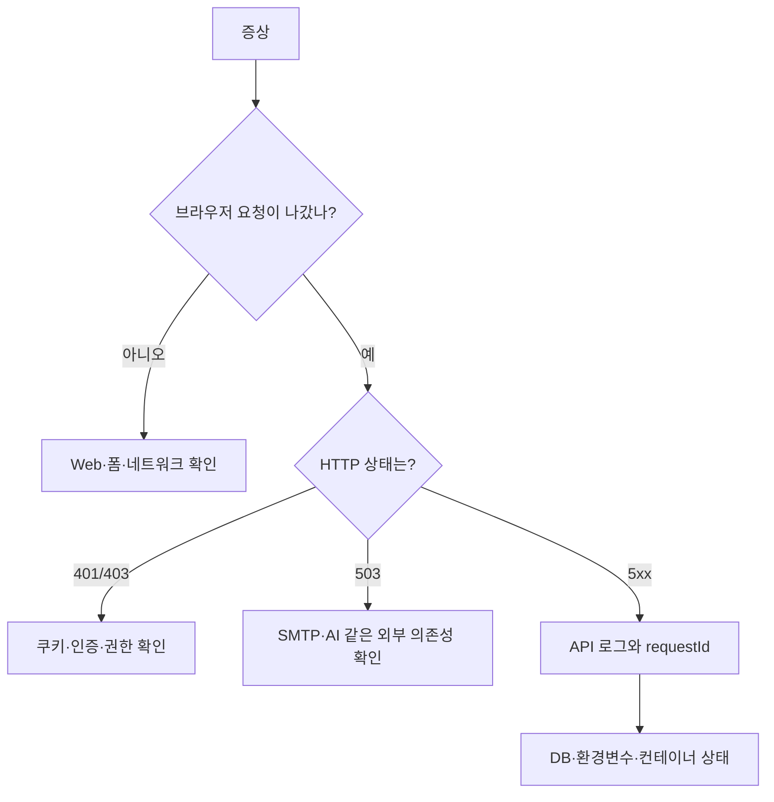

# 18. 장애를 논리적으로 찾는 법

## 이 장에서 답할 수 있게 되는 것

- 오류를 봤을 때 어디부터 확인하는가
- "무엇이 이미 성공했는가"를 먼저 묻는 이유

## 먼저 생각해 보기

오류 코드 하나를 봤을 때 “다시 해 보기”보다 먼저 물어야 할 질문은 무엇일까?

## 핵심 해설

문제를 계층으로 나누면 추측이 줄어든다.

| 증상 | 먼저 해석할 사실 | 대표 원인 |
| --- | --- | --- |
| refresh 401 | 로그인 쿠키가 있는가 | 비로그인 방문, 만료 세션 |
| signup 503 + users 행 존재 | DB 저장은 됐는가 | SMTP 인증/발송 실패 |
| DB에 테이블 없음 | 같은 DB를 보고 있는가 | migration 미적용, 다른 database 연결 |
| 메일이 안 옴 | Mailpit인지 실제 SMTP인지 | 개발/운영 환경 혼동 |
| API healthy 아님 | 어느 의존성이 준비 안 됐는가 | DB URL, 환경변수, 컨테이너 상태 |

좋은 진단은 “무엇이 실패했는가”뿐 아니라 “무엇은 이미 성공했는가”를 분리한다. 예를 들어 signup 503에서도 users 행이 있으면 가입 저장 단계는 성공했고, 다음 SMTP 단계가 실패한 것이다.

## 이해 점검

**Q. 오류가 난 화면만 보고 DB를 바로 수정하면 위험한 이유는?**  
**A.** 화면·API·DB·외부 서비스 중 실패 지점이 다를 수 있다. 증거 없이 데이터를 지우면 원인을 숨기거나 관계 데이터를 깨뜨릴 수 있다.

## 흔한 오해

컨테이너를 단순 재시작해도 환경변수 변경이 반영되지 않을 수 있다. 컨테이너 생성 시점에 읽은 설정과 현재 파일 내용은 다를 수 있다.

---

다음 장 → [19. 용어와 발표 연습](./19-glossary-and-explanation.md)
