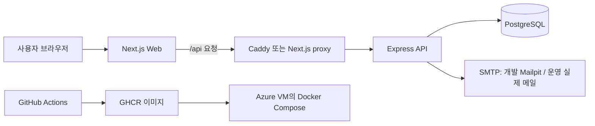

# SourceWiki 이해 교재

이 폴더는 SourceWiki를 **기술 이름 암기**가 아니라 **요청과 데이터의 흐름**으로 이해하기 위한 한국어 교재다. 실제 실행 명령을 따라 하기보다, 각 구성 요소가 왜 존재하고 무엇을 주고받는지 설명한다.

**이 교재만 순서대로 읽으면 전체 흐름을 잡을 수 있도록** 구성했다. 전체 분량은 한 번에 읽어도 1~2시간 정도다. 처음에는 외우려 하지 말고 "알겠다 / 모르겠다"만 표시하며 끝까지 읽는 편이 좋다.

> **시간이 없다면** [22. 예상 질문 질문지](./22-question-sheet.md)부터 본다. 예상 질문 67개를 한곳에 모아 짧게 답해 둔 문서라, 지금 무엇을 모르는지 10분 안에 파악할 수 있다.

## 먼저 보는 전체 지도

## 권장 읽기 순서

각 장 끝에 "다음 장" 링크가 있으므로 순서대로 따라가면 된다.

| # | 장 | 무엇을 다루는가 |
| --- | --- | --- |
| 1 | [01. 서비스와 전체 요청](./01-service-and-request.md) | 전체 지도와 이 교재의 목표 질문 |
| 2 | [02. 저장소와 프론트엔드](./02-monorepo-and-frontend.md) | 폴더 구조와 공용 규칙 |
| 3 | [03. Frontend 상태관리와 데이터 흐름](./03-frontend-state-and-data-flow.md) | 서버 상태와 화면 상태, query key |
| 4 | [03b. 서버 렌더링과 화면 이어받기](./03b-server-rendering-and-hydration.md) | SSR·hydration, 두 개의 fetch |
| 5 | [04. Frontend API·에러·인증 심화](./04-frontend-api-error-auth.md) | 공통 래퍼, 토큰 전달, 오류 표시 |
| 6 | [05. 백엔드와 API](./05-backend-and-api.md) | middleware 순서, Origin 검사, 응답 형태 |
| 7 | [06. 데이터베이스와 Prisma](./06-database-and-prisma.md) | 테이블과 관계의 기본 |
| 8 | [07. 인증과 이메일](./07-authentication-and-email.md) | 가입·인증·JWT claim |
| 9 | [08. 인증 기능 완전 추적](./08-auth-complete-trace.md) | 인증 전 구간 코드 추적 |
| 10 | [09. 자료 기능과 권한](./09-source-features-and-permissions.md) | 자료·댓글 기능 개요와 권한 위치 |
| 11 | [09b. 자료·댓글 CRUD 완전 추적](./09b-source-crud-complete-trace.md) | 생성·조회·수정·삭제 코드 추적, 캐시 갱신 |
| 12 | [09c. 페이징·검색·파일 업로드](./09c-pagination-search-and-files.md) | 목록 나누기, 필터, 첨부 파일 |
| 13 | [10. 화면·기능 코드 지도](./10-screen-feature-code-map.md) | 화면별 시작 파일 표 |
| 14 | [11. API 계약 사전](./11-api-contract-atlas.md) | endpoint 목록과 Swagger 생성 |
| 15 | [12. DB 스키마 완전 해설](./12-database-schema-atlas.md) | 관계 설계 근거, 인덱스, 삭제 정책 |
| 16 | [13. Docker와 로컬 환경](./13-docker-and-local-environment.md) | 컨테이너와 Compose |
| 17 | [14. 프록시와 네트워크](./14-caddy-and-network.md) | Caddy, 같은 출처 유지 |
| 18 | [15. 테스트와 품질](./15-testing-and-quality.md) | 테스트 종류와 CI |
| 19 | [16. 개발·CI·운영 환경 비교](./16-environment-lifecycle.md) | 환경별 차이 |
| 20 | [17. Azure 배포와 운영](./17-cloud-deployment-and-operations.md) | 이미지 배포와 운영 점검 |
| 21 | [18. 장애를 논리적으로 찾는 법](./18-troubleshooting-thinking.md) | 계층별 원인 추적 |
| 22 | [19. 용어와 발표 연습](./19-glossary-and-explanation.md) | 1분 설명과 용어 |
| 23 | [20. 발표 예상 질문 답변 카드](./20-presentation-qa-cards.md) | 질문별 30초 답변과 근거 |
| 24 | [21. 최종 소크라틱 점검](./21-final-socratic-checklist.md) | 못 답한 질문을 되짚는 법 |
| 25 | [22. 예상 질문 질문지](./22-question-sheet.md) | 예상 질문 67개와 짧은 답, 자가 점검표 |

## 읽는 법

각 장은 같은 순서로 진행된다.

- **이 장에서 답할 수 있게 되는 것**: 이 장을 읽고 나면 무엇을 말할 수 있어야 하는지 먼저 확인한다.
- **먼저 생각해 보기**: 답을 외우기 전에 문제를 스스로 정의한다.
- **핵심 해설**: 초보자 눈높이의 비유와 프로젝트의 실제 구현을 연결한다.
- **흐름도와 표**: 한 번에 많은 관계를 본다.
- **이해 점검**: 말로 설명할 수 있는지 확인한다.
- **흔한 오해**: 비슷해 보이지만 다른 개념을 구분한다.

> AI 기능은 현재 운영에서 `demo` 모드다. 실제 모델 설치·연결은 향후 별도 학습 주제로 다룬다.

## 평가 항목이 어느 장에 있는지

`requirement-q.md`의 평가 기준과 교재를 연결한 표다. 발표 직전에 빈칸이 없는지 확인한다.

| 평가 항목 | 해당 장 |
| --- | --- |
| JWT 토큰에 담은 정보 | [07](./07-authentication-and-email.md), [08](./08-auth-complete-trace.md), [22](./22-question-sheet.md) |
| 테이블 관계 설계 기준 | [06](./06-database-and-prisma.md), [12](./12-database-schema-atlas.md), [22](./22-question-sheet.md) |
| 상태 관리 라이브러리와 선택 이유 | [03](./03-frontend-state-and-data-flow.md), [22](./22-question-sheet.md) |
| API 호출 방식과 관리 위치 | [04](./04-frontend-api-error-auth.md), [11](./11-api-contract-atlas.md), [22](./22-question-sheet.md) |
| 공통 API 요청 구조·토큰 전달 | [04](./04-frontend-api-error-auth.md), [22](./22-question-sheet.md) |
| 프론트엔드 에러 처리와 공통 구조 | [04](./04-frontend-api-error-auth.md), [05](./05-backend-and-api.md), [22](./22-question-sheet.md) |
| 로그인 상태 확인·저장 위치 | [03](./03-frontend-state-and-data-flow.md), [08](./08-auth-complete-trace.md), [22](./22-question-sheet.md) |
| 새로고침 시 로그인 유지 | [03b](./03b-server-rendering-and-hydration.md), [08](./08-auth-complete-trace.md), [22](./22-question-sheet.md) |
| 인증 페이지 접근 제어 | [03b](./03b-server-rendering-and-hydration.md), [09b](./09b-source-crud-complete-trace.md), [22](./22-question-sheet.md) |
| 토큰 만료 시 동작 | [04](./04-frontend-api-error-auth.md), [08](./08-auth-complete-trace.md), [22](./22-question-sheet.md) |
| 메일 인증 방식 | [07](./07-authentication-and-email.md), [08](./08-auth-complete-trace.md), [22](./22-question-sheet.md) |
| **게시판 CRUD** | [09](./09-source-features-and-permissions.md), [09b](./09b-source-crud-complete-trace.md), [22](./22-question-sheet.md) |
| **댓글** | [09b](./09b-source-crud-complete-trace.md), [22](./22-question-sheet.md) |
| **페이징** | [09c](./09c-pagination-search-and-files.md), [22](./22-question-sheet.md) |
| 검색·파일 업로드(선택) | [09c](./09c-pagination-search-and-files.md), [22](./22-question-sheet.md) |
| Swagger 문서 | [11](./11-api-contract-atlas.md), [22](./22-question-sheet.md) |
| Docker | [13](./13-docker-and-local-environment.md), [16](./16-environment-lifecycle.md), [22](./22-question-sheet.md) |
| 클라우드 배포·GitHub Actions | [15](./15-testing-and-quality.md), [17](./17-cloud-deployment-and-operations.md), [22](./22-question-sheet.md) |

## 발표 준비 순서

전체를 한 번 읽은 뒤 **22장 질문지로 자가 점검**을 하고, 막힌 묶음만 골라 다시 읽는다. 시간이 부족하면 **22 → 03 → 03b → 04 → 09b → 09c → 10 → 08 → 11 → 12 → 16 → 20 → 21** 순서로 본다. 20번은 답을 외우기 위한 문서가 아니라, "어떤 코드가 그 답을 뒷받침하는가"를 확인하는 발표 카드다.

---

첫 장으로 → [01. 서비스와 전체 요청](./01-service-and-request.md)
