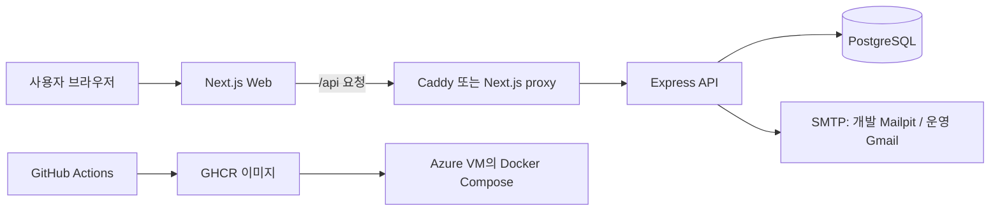

# SourceWiki 이해 교재

이 폴더는 SourceWiki를 **기술 이름 암기**가 아니라 **요청과 데이터의 흐름**으로 이해하기 위한 한국어 교재다. 실제 실행 명령을 따라 하기보다, 각 구성 요소가 왜 존재하고 무엇을 주고받는지 설명한다.

## 먼저 보는 전체 지도

## 권장 읽기 순서

1. [01. 서비스와 전체 요청](./01-service-and-request.md)
2. [02. 저장소와 프론트엔드](./02-monorepo-and-frontend.md)
3. [03. 백엔드와 API](./03-backend-and-api.md)
4. [04. 데이터베이스와 Prisma](./04-database-and-prisma.md)
5. [05. 인증과 이메일](./05-authentication-and-email.md)
6. [06. 자료 기능과 권한](./06-source-features-and-permissions.md)
7. [07. Docker와 로컬 환경](./07-docker-and-local-environment.md)
8. [08. 프록시와 네트워크](./08-caddy-and-network.md)
9. [09. 테스트와 품질](./09-testing-and-quality.md)
10. [10. Azure 배포와 운영](./10-cloud-deployment-and-operations.md)
11. [11. 장애를 논리적으로 찾는 법](./11-troubleshooting-thinking.md)
12. [12. 용어와 발표 연습](./12-glossary-and-explanation.md)
13. [13. Frontend 상태관리와 데이터 흐름](./13-frontend-state-and-data-flow.md)
14. [14. Frontend API·에러·인증 심화](./14-frontend-api-error-auth.md)
15. [15. 발표 예상 질문 답변 카드](./15-presentation-qa-cards.md)
16. [16. 화면·기능 코드 지도](./16-screen-feature-code-map.md)
17. [17. 인증 기능 완전 추적](./17-auth-complete-trace.md)
18. [18. API 계약 사전](./18-api-contract-atlas.md)
19. [19. DB 스키마 완전 해설](./19-database-schema-atlas.md)
20. [20. 개발·CI·운영 환경 비교](./20-environment-lifecycle.md)
21. [21. 최종 소크라틱 점검](./21-final-socratic-checklist.md)

## 읽는 법

각 장은 같은 순서로 진행된다.

- **먼저 생각해 보기**: 답을 외우기 전에 문제를 스스로 정의한다.
- **핵심 해설**: 초보자 눈높이의 비유와 프로젝트의 실제 구현을 연결한다.
- **흐름도와 표**: 한 번에 많은 관계를 본다.
- **이해 점검**: 말로 설명할 수 있는지 확인한다.
- **흔한 오해**: 비슷해 보이지만 다른 개념을 구분한다.

> AI 기능은 현재 운영에서 `demo` 모드다. 실제 Ollama 모델 설치·연결은 향후 별도 학습 주제로 다룬다.

## 발표 준비 순서

전체 구조를 먼저 설명할 수 있게 된 뒤, **13 → 14 → 16 → 17 → 18 → 19 → 20 → 15 → 21** 순서로 읽는다. 15번은 답을 외우기 위한 문서가 아니라, “어떤 코드가 그 답을 뒷받침하는가”를 확인하는 발표 카드다.
